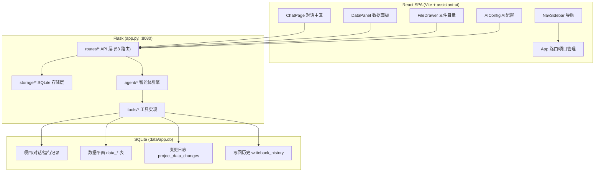

# Finance Agent Workbench — 项目架构文档

> **版本**：v6.18（2026-08-24，**文件预览 + Markdown 编辑器 D1-D8 全量落地**）：
> ① **D1 后端格式映射**——`routes/files.py` `_viewer_type` 补 `.xls`→xlsx（归一化）；`can_open_external`/`open-external` 白名单补 `xls`。
> ② **D2 Vditor 内网化 + MarkdownEditor**——`npm i vditor@3.11.3`；`node_modules/vditor/dist`（532 文件）→ `frontend/public/vditor/`（**包根结构**，dist 内嵌）；`options.cdn = BASE_URL + "vditor/"`（prod=/static/app/）；新建 `frontend/src/components/MarkdownEditor.tsx`（Vditor 封装：mode="ir" 即时渲染 + 精简工具栏 + 自定义「导出 Word」按钮 + 内置「导出」PDF 下拉；XSS sanitize 默认开）。
> ③ **D3 项目目录双击分发**——`FileDrawer.handleOpen` 按 viewer_type 分流；`FileEditor.tsx` 改造为按 type 分发容器（markdown/pdf/image/text/office）。
> ④ **D4 导出 Word/PDF**——下载 Pandoc 3.10.2 → `offline_packages/pandoc/pandoc.exe`（扁平化）；`routes/files.py` 新增 `POST /api/files/export-docx`（`pandoc -f markdown+tex_math_dollars -t docx`，content 优先，缺失返回 501 不降级）；PDF 走 Vditor 内置导出（浏览器打印）。
> ⑤ **D5 应用二报告容器**——`routes/apps.py` 新增 `POST /api/apps/finmod/export-docx`（报告 md 在 tmp_runs，不走 work_dir 校验；content 优先）；`FinModAppPage` 报告区 `MarkdownBlock`→`MarkdownEditor`（可编辑 + 导出 Word/PDF），新增 `reportEditText` state + `handleExportWord` +「导出 Word」按钮。
> ⑥ **D6 测试验收文档**——新增 `docs/_test_preview_d1.py` 47 断言；`_test_finmod_r1_e2e.py` 新增清理段（消除 `__test_r1_multi__` 污染主库）。
> ⑦ **D7 新标签页预览**——双击文件用 `window.open('/?preview=1&project_id=&path=')` 打开独立浏览器 tab；`App.tsx` 新增 `readPreviewParams()` 解析 `?preview=` 参数，预览模式跳过侧栏/主布局直接渲染 `PreviewPage`；新建 `pages/PreviewPage.tsx`（全屏无侧栏，复用 FileEditor）；`ChatPage`/`DataCheckAppPage` 移除 `openFile` 死代码，office 双击本地打开不变。
> ⑧ **D8 论文/报告排版（预览即排版）**——依据 `docs/格式.md`（GB/T 7713 学位论文规范）；预览用 `.vditor-reset` CSS（预览即所见即所得）；Word 用 Pandoc `--reference-doc=offline_packages/pandoc/reference-template.docx`；PDF 用 `@media print`（A4 + 页边距）；新建 `scripts/_build_reference_docx.py`（zipfile 编辑 reference.docx XML，无 python-docx 依赖）生成模板；后端 export-docx 加 `--reference-doc`。
> **v6.17**（2026-08-24，**文件预览 + Markdown 编辑器 D1-D6 全量落地**）：
> ① **D1 后端格式映射**——`routes/files.py` `_viewer_type` 补 `.xls`→xlsx（归一化）；`can_open_external`/`open-external` 白名单补 `xls`。
> ② **D2 Vditor 内网化 + MarkdownEditor**——`npm i vditor@3.11.3`；`node_modules/vditor/dist`（532 文件）→ `frontend/public/vditor/`（**包根结构**，dist 内嵌）；`options.cdn = BASE_URL + "vditor/"`（prod=/static/app/）；新建 `frontend/src/components/MarkdownEditor.tsx`（Vditor 封装：mode="ir" 即时渲染 + 精简工具栏 + 自定义「导出 Word」按钮 + 内置「导出」PDF 下拉；XSS sanitize 默认开）。
> ③ **D3 项目目录双击分发**——`FileDrawer.handleOpen` 按 viewer_type 分流（office→`openExternalFile` 本地打开 / pdf/图片→浏览器预览 / 文本→readFileContent）；`FileEditor.tsx` 改造为按 type 分发容器（markdown/pdf/image/text/office）；`DataCheckAppPage.handleOpenOutput` 对齐矩阵。
> ④ **D4 导出 Word/PDF**——下载 Pandoc 3.10.2 → `offline_packages/pandoc/pandoc.exe`（扁平化）；`routes/files.py` 新增 `POST /api/files/export-docx`（`pandoc -f markdown+tex_math_dollars -t docx`，content 优先，缺失返回 501 不降级）；PDF 走 Vditor 内置导出（浏览器打印）。
> ⑤ **D5 应用二报告容器**——`routes/apps.py` 新增 `POST /api/apps/finmod/export-docx`（报告 md 在 tmp_runs，不走 work_dir 校验；content 优先）；`FinModAppPage` 报告区 `MarkdownBlock`→`MarkdownEditor`（可编辑 + 导出 Word/PDF），新增 `reportEditText` state + `handleExportWord` +「导出 Word」按钮。
> ⑥ **D6 测试验收文档**——新增 `scripts/_test_preview_d1.py` 47 断言；`_test_finmod_r1_e2e.py` 新增清理段（消除 `__test_r1_multi__` 污染主库）。
> **v6.16**（2026-08-24，**工作台总览 Dashboard D1-D7 全量落地**）：
> ① **D1 会话计时器**——新增 `app_sessions` 表（`storage/schema.sql`）+ `storage/session_store.py`（`SessionStore.start` 启动插 open 行 / `close` atexit 幂等写 end_at / `heartbeat` ≥60s 节流 / `_close_stale(exclude_id)` 崩溃兜底）+ `app.py` 生命周期钩子（create_app 内 `_session_store.start()` 存 `APP_SESSION_ID` + `atexit.register` + `before_request` 心跳，`check_same_thread=False` 多线程安全）。时间口径 = **软件打开会话时长**（v1.2 定稿：打开即计时、关闭即结束、纯离线从安装起累计）。
> ② **D2 后端聚合端点**——`routes/dashboard.py` 新建 `dashboard_bp`：`GET /api/dashboard/summary?days=7&limit=10` 一次返回 `{ts, status, projects, apps, usage, time_trend, active_hours, run_status, activity, errors_today}`；会话时长 Python 逐会话**按天切分**（跨午夜 `min(end,次日00:00)−max(start,当日00:00)`，UTC 日边界）；open 会话用当前时间作临时 end（今日时长实时）；查询前 `_close_stale(exclude_id=当前会话)`；每子查询独立 try/except 容错；零 token/智能体依赖（v1.1 评审）。
> ③ **D3-D6 前端**——`frontend/src/lib/dashboard.ts`（类型 + `fetchDashboardSummary`）；`pages/DashboardPage.tsx`（顶栏状态徽标/时钟/简约刷新图标 → 欢迎大字一行 → **5 指标卡**（StatCard 数字递增动画）→ **2 分析卡**（TimeTrendChart 7日趋势 bar-line 双轴 / ActiveHoursChart 活跃时段 bar，复用 chart-templates 生态 + overrides 简约化）→ 联动区（最近项目 + AppEntryCard 应用入口））；`App.tsx` `view==="dashboard"` 渲染分支。
> ④ **D7 联调验收 + v1.4 用户逐项调整**——删除主题切换（浅色唯一）、删除指标卡「平均单次打开时长」、删除分析卡「运行状态分布」、删除最近活动流；欢迎标题一行大字；页边距 `px-8 py-7` + 卡片 `p-5`；D1 6/6 + D2 34/34 回归全 PASS + 浏览器端到端（五区渲染/会话实时计时/3 项跳转联动）全通过。
> **v6.15**（2026-08-23，**应用二「财务建模与分析」报告生成器重构 R1-R6 全量落地**）：
> ① **R1 多文件支持**——新增 `tools/finmod_merge.py`（`merge_files_for_model` 跨文件自动合并引擎：同构≥0.6→concat / 有共同键→join / 否则→union / 单文件→single；`collect_all_columns` 多文件列索引并集）；`routes/apps.py` 全部 finmod 端点 `file_name` → `file_names[]`（varmap/varmap-suggest/derived-eval/prep-data/run/analyze/guide + `_assess_readiness`/`_model_var_coverage`/`_finmod_varmap` 多文件完备性）；前端 `FinModAppPage` 新增 `selectedFiles`/`analysisFiles`/`analysisFileNames`/`toggleAnalysisFile`（步骤 1 多文件勾选卡片）+ `api.ts` 各函数 `fileNames?` 参数；`run` 返回 `merge_strategy`/`merge_logs`/`files_used`。
> ② **R2 迭代回环**——模式 B「建议的建模方向」顶部数据需求卡（`selectedMissingNeeds` 汇总选中模型 `var_coverage.truly_missing_details` → 缺变量红色 chips + 可派生徽章 + 「上传/补数据文件」+「重新引导」）；`runGuide` 默认只勾选 `ready==true` 模型；已选清单区「N 个字段待补」提示。
> ③ **R3 4步化**——`FLOW_STEPS` 6 步→4 步（诉求与数据 / 宏观建模与映射 / 图表风格 / AI 撰写报告）；步骤 2 内 `macroPhase`（direction/varmap 子阶段 tab）+ 步骤 4 内 `reportPhase`（execute/report 子阶段 tab）；执行并入报告（`enterStep6`→步骤 4 + `setReportPhase`，执行完成自动衔接报告）；全部跳转/回退/历史按新 4 步值重映射。
> ④ **R4 图表偏好**——`charts-suggest` 增加 `style_prefs`（{level, colors, categories[]}）+ 重要性标注 `importance`（primary/secondary/optional，命中偏好升一级、未命中降一级）+ 图表类别 `CHART_CATEGORIES`（trend/compare/share/sensitivity/distribution/relation）；前端「图表风格偏好」区块（复杂度/偏好类型多选/配色）+ 推荐卡 importance 徽章 + 「图表库勾选（可选微调）」+「图表构成偏好清单」。
> ⑤ **R5 报告模板 + R5.1 降 AI 味**——SKILL.md 新增「财务建模与分析报告模板」章节（券商研报结构：核心观点/分析基础/分析过程/结论与建议 + 降 AI 味用语规范表）；`REPORT_SYSTEM` 重写（结论先行 + 禁比喻/华丽词/感叹号/引号破折号/空泛结论 + 数据锚定 + 聚焦单点）；`export-md` 输入增强（`data_stats` 数据统计 + `style_prefs` + importance 图表清单）；`finmod_run` 返回 `data_stats`；`_fallback_md_report` 同步新骨架。
> ⑥ **R6 联调验收**——多文件端到端（一季度 87 行 + 二季度 110 行真实数据：引导引用两季度 → 合并 17 行 → 6 图 SVG 落盘 → 券商研报风格报告）；修复步骤 4 子阶段条（execute 点击已有结果不重跑）。
> **v6.14**（2026-08-23，**柱状图/折线图图库按用户附件重构**）：
> ① **bar 重构为 5 变体**（`chart-templates/bar.ts`）：`bar`（分组柱状，默认）· `bar-simple`（简单柱）· `bar-line`（折线柱状=柱+折线双 y 轴，附件【第二种】）· `bar-negative`（正负条形=横向绿正红负，附件【第三种】）· `bar-fancy`（分组折线柱状=多年柱+custom trend 折线，附件【第四种】）。**删除** bar-rounded/bar-horizontal/bar-threshold/bar-stacked（用户未提供）。
> ② **line 重构为 3 变体**（`line.ts`）：`line`（多维折线·分组对比，默认，多系列+极值/平均线，附件【第一种】）· `line-simple`（简单折线）· `line-multi-x`（多x轴折线，双 x 轴，附件【第二种】）。**删除** line-area/area-stack/step/forecast（用户未提供）。
> ③ **变体中文名**：面向用户显示中文（分组柱状图/简单柱状图/正负条形图/折线柱状图/分组折线柱状图/多维折线图/多x轴折线图）。
> ④ **skill 同步**：`charts/bar.md`/`line.md` 重写（含适用点/变量点/优势点表）+ SKILL.md 模板索引（25→24 类型，删 bar-stacked）+ `references/index.md` + `chart-style.md` 柱状/折线编码节 + 删 `charts/bar-stacked.md`。
> ⑤ **后端同步**：`financial_analysis_tools.py` `CHART_TEMPLATES`/`CHART_VARIANTS`（删 bar-stacked，bar 5/line 3 变体）+ `generate_chart` bar/line 分支重写（bar-line 折线保留 type、bar-fancy custom 系列保留、bar-negative 横向堆叠）+ `routes/apps.py` `_MODEL_CHART_PREFS`（变体名同步新集合）+ `var_pref`（bar/line 默认）+ `_finmod_models.py` `recommended_charts`（line-forecast/bar-stacked→line/bar）。
> ⑥ 前端 `ChartPreview.sampleDataFor` 同步各新变体示例数据；`GuideCard`/`SkillConfigPanel` 删 bar-stacked 映射。
> **v6.13**（2026-08-23，**放弃 3D 图 plotly 在线交互，回退静态图片**——用户反馈 v6.11 的 plotly 拖拽/缩放效果不佳，决策**只针对 3D（waterfall3d/bar3d/scatter3d）放弃在线交互**，改回 matplotlib 生成的 **base64 PNG 静态图片**；**二维平面图表完整保留 ECharts 交互**（拖拽缩放/dataZoom/下载等不变））：
> ① 前端删除 `components/Plotly3DChart.tsx`（不再用 plotly.js 渲染）与 `public/plotly.min.js`（4.85MB 资源），构建产物 dist 无 plotly 引用（已 grep 验证 `Plotly3DChart`/`plotly`/`js-plotly` 均 False）。
> ② `ChartPreview.tsx` `PythonChartPreview` & `ChartRenderer.tsx` `Python3DImage`：去掉 `fig_json → Plotly3DChart` 分支，**只保留 base64 PNG `` 静态图**（点击放大/下载 via PythonImageLightbox）。说明行改「由 Python(mplot3d) 生成 · 立体图为静态图片样例（点击放大/下载，不支持拖动缩放）」。
> ③ **后端 Python 代码与提示词模板保留不动**：`render_py_chart` 仍返回 `b64`（PNG）+ `fig_json`/`interactive`（供 AI 提示词/模板图片对照），前端仅使用 `b64`；`api.ts FinmodPyChartResult` 注释更新 fig_json 为「仅保留供对照，前端不再渲染」。
> ④ 自然语言对话页（AI 输出）插入 3D 图为**图片形式**；财务建模图表库预览也插回**图片样例**（像最初图片样例）。
> **v6.12**（2026-08-23，**修复 3D 图「细长柱」+ 重构 bar3d/scatter3d + 确认清单变体锁定**）：
> ① **细长柱根因**：`_plotly_layout` 旧用 `aspectmode="manual"` + `aspectratio=dict(x=点数, y=点数, z=最大值)`，把 z 轴（值可到 74）拉到 x/y 轴（点数仅 3/5）的几十倍；实测 `aspectmode="data"` 时 plotly 自动算出 ratio≈(0.24, 0.47, 8.97)（z 是 x 的 38 倍）→ 所有 3D 图被压成细长柱。改用 **数据感知归一化 aspectratio**（`extent` → log 映射 `_shrink` 到 [0.5,2]，模拟 matplotlib box_aspect 精神），waterfall3d 变 (1.03,1.27,2.0)、scatter3d 变 (1.44,1.43,1.99)，不再细长。
> ② **bar3d 重构为官网「二维数据直方图」**：`_hist2d()` 对二维点集 `[[x,y],...]` 做 `np.histogram2d`（柱高=频数，默认 4×4/5×5/6×6 自适应），matplotlib `bar3d`/plotly `Mesh3d` 等宽柱+蓝渐变；兼容旧三元组 `[[x,y,z],...]`（向后兼容取 (x,y)）。`generate_chart` bar3d 分支同步（二维点→histogram2d 得到频数柱）。
> ③ **scatter3d 大数据量趋势**：示例数据 ≥1200 点（z=2x+3y+噪声相关云），气泡随点数自适应缩小（`size=4000//n`）；趋势感+散点魅力。
> ④ **确认清单变体锁定**：`ChartLibrary.onSelect` 携带当前预览变体（`variantId[chart.id] || chart.id`）；`ChartManifest` 变体从下拉改为**只读文本**（`bar3d`/`waterfall3d`），**保留配色下拉**（自动/蓝/绿/红/橙/紫/黑灰）；`onVariantChange` 改为可选。
> ⑤ 前端 `ChartPreview.sampleDataFor` 同步 bar3d/scatter3d 新数据形态；镜像镜像目录不更新。
> **v6.11**（2026-08-23，3D 图交互升级：plotly 可拖拽旋转/缩放/下载——matplotlib `plt.show()` 是桌面 GUI（TkAgg）无法进 Web，改用 **plotly**（Python 生成 `fig_json` + 前端 plotly.js 渲染，自带 modebar：Orbital/Turntable rotation、Zoom/Pan、Download PNG，**无需自研窗口**）。离线打包 `plotly==6.9.0`（offline_packages + venv 安装）+ `plotly.min.js`（4.85MB → `frontend/public/`，Vite base `/static/app/` 构建，Flask `/static/app/plotly.min.js` 服务）；后端 `finmod_py_charts.py` `render_py_chart` 新增 `fig_json`/`interactive`（`_plotly_layout` 用 plotly 6.x `title=dict(text,font)`，`titlefont` 已弃用）+ `waterfall3d_plotly`/`bar3d_plotly`/`scatter3d_plotly`；前端 `components/Plotly3DChart.tsx`（`window.Plotly.newPlot` + modebar）+ `ChartPreview.tsx`/`ChartRenderer.tsx` Python 分支优先 fig_json（静态图兜底）；`api.ts FinmodPyChartResult` 加 `fig_json`/`interactive`；**图表确认清单删缩略图**（`ChartManifest.tsx` 删除左侧 `ChartPreview`，行布局改 `flex items-center`，仅序号+名称+变体/配色+上移下移移除））
> **v6.10**（2026-08-23，3D 模板改由 Python(mplot3d) 生成 PNG：echarts-gl 的 surface3D/bar3D 无法复刻「每指标折线围成的填充平面」瀑布样式（会把行连成曲面/只能柱状）且 3D 无矢量导出——**用户决策：立体瀑布图/立体柱状图/立体散点图全部改用 Python 生成**。新增 `tools/finmod_py_charts.py`（waterfall3d_png/bar3d_png/scatter3d_png + render_py_chart，复刻「财务指标对比.py」每指标折线+Poly3DCollection 竖直填充面+数值标注+跨指标虚线，**图内不含大标题**）+ 后端 `POST /api/apps/finmod/py-chart` + `generate_chart` 注入 `option._py_data`；前端 `finmodPyChart()` + `PythonImageLightbox`（点击放大+下载 PNG）+ `ChartPreview`/`ChartRenderer` 的 `PY3D_TEMPLATES` 分支（`` 展示）+ `FinModAppPage.runReport` 3D 模板改 Python PNG 落盘 + `finmod_run` 3D 数据适配；`chart-templates/waterfall3d.ts`/`bar3d.ts`/`scatter3d.ts` build 加「退役标注」（仅保留解析/骨架兼容）；skill 指引（SKILL.md/chart-style.md/charts 文档/index.md/smol_tools 工具描述）全部更新为「3D 由 Python 生成、AI 无需介入、图内无标题、不支持矢量导出」）
> **v6.9**（2026-08-23，新增「3D 瀑布图 waterfall3d」模板，类型 24→25：复刻用户「财务指标对比.py」（x=年份、y=财务指标、z=数值，surface3D 填充面 + line3D 轮廓线，visualMap 按 y 维度蓝渐变）；同步 5 处：前端模板 waterfall3d.ts + 注册表 index.ts + skill 模板 waterfall3d.md（L3 档）+ SKILL.md 主文档 L3 档 + 后端 financial_analysis_tools.py（CHART_TEMPLATES/CHART_VARIANTS/generate_chart 分支）+ 示例数据 ChartPreview.tsx（sampleDataFor sampleDataToRows））
> **v6.8**（2026-08-22，图表展示统一为「本模板最终效果」+ AI 推荐卡同款展开：删除 22 张官方 PNG（`chart-examples.ts` 移除，不再展示第三方参考图）；`ChartLibrary` 展开面板「效果预览」改名「模板预览」（🛠 图标 + 副标「此即最终图表效果」+ 变体名动态显示），移除「官方示例标杆」区块；AI 推荐卡改与图表库同款展开卡（折叠=AI 徽章+名称+理由+加入；展开=模板预览+示例数据表 SampleTable）；样例数据加量（折线/柱 24 个月、散点 60 点）；radar 官方径向渐变区域、sankey 官方节点圆角+渐变边）；**v6.8-2 修复：`ChartPreview.tsx` 模板解析统一改用 `resolveTemplate` 完整解析（原 `split("-")[0]` 使 dual-axis/error-bar/histogram-4grid 显示「未知模板」，sampleDataFor 数据分支 + templateDisplayName 同步修复）**
> v6.7（2026-08-22，数据完备性校验前移至步骤 2 建模方向：`_model_var_coverage` 确定性计算模型变量×数据列覆盖度（宽松语义兜底：numeric 变量有数值列即视为可映射/period 有期间列可映射），`_finmod_guide` 模式 B 时每个 direction 附 `var_coverage`（matched/missing/statistic/missing_names）；前端 `GuideCard` 显示数据完备性徽章（绿「变量已齐」/黄「缺 N 个变量」+ 缺失字段提示回步骤 1 补数据）；模式 B 默认勾选过滤变量不足模型（ready 优先，全缺则全选让用户决策）——变量映射回归辅助确认角色，不再对建模起决定性作用）
> v6.6（2026-08-22，图表模板整改阶段 3：AI 输出官方级优化通道——`generate_chart` 返回前自动注入官方动画（animationDuration:1500 + cubicOut）+ 大数据量（类别>12）标签自动降采样（option_overrides 仍可覆盖）；`_finmod_chart_suggest` 推荐官方级变体（bar→rounded/line→area/scatter→effect/radar→multi/heatmap→discrete/gauge→progress 等，default_variant 字段）+ note 说明；SKILL.md 新增「官方级图表」指导（数据量≥12 点、禁止最小数据、大数据量用 dataZoom 变体、优先官方级变体）；执行链路 buildChartOption 已含官方动画（阶段 1）——全链路 AI 输出对齐 ECharts 官方示例）
> v6.5（2026-08-22，图表模板整改阶段 2：图表库嵌入官方标杆图——22 张 ECharts 官方代表示例缩略图本地化（`frontend/src/assets/chart-examples/`，内网离线可用），新建 `chart-examples.ts` 映射（CHART_EXAMPLE_IMG/SRC + chartExampleImg/chartExampleSrc）；ChartLibrary 展开面板顶部新增「官方示例标杆」区块（大数据量官方呈现 + 来源标注 + 说明），变体切换联动；3D 模板（scatter3d/bar3d）官方无缩略图回退真实预览；新建 `src/vite-env.d.ts`（vite/client 类型，png import 支持））
> v6.4（2026-08-22，图表模板官方级整改阶段 1：`sampleDataFor` 样例数据全面加量（12 月/8-10 项占比/30 点散点/48 格热力/10 节点桑基，对齐 ECharts 官方示例数据量）+ `buildChartOption` 统一注入官方动画（animationDuration:1500 + cubicOut）+ bar/bar-stacked/line-area 官方线性渐变 + pie emphasis 悬停放大 + 类别>12 数据点标签自动降采样；修复 pie/sankey 样例数据结构与 build 不匹配（空白）问题）
> v6.3（2026-08-22，图表配置页面向用户可视化 + 取消滑块：ChartLibrary 展开面板主体改「效果预览示例图 + 示例数据表」（一句话用途 + 变体 chips 点击即换图），文字性内容收敛为折叠「选型参考」；全图表 zoom2D/zoomXOnly 移除可见 slider 拖动条（仅保留 inside 滚轮缩放+拖拽平移），图表展示即最终版本，ChartRenderer/DownloadPanel/chart-templates 同步无滑块；**v6.3-2 容器放大修复**：展开面板改垂直堆叠——效果预览全宽 320px 高（实测 536×320 / canvas 670×400，此前并排被挤到 224×208 导致元素拥挤），示例数据表移下方，预览注明「真实 ECharts 渲染 · 非图片」）
> v6.2（2026-08-21，上传大文件卡顿修复：`formula_fallback` 公式兜底重算默认禁用（`FINMOD_FORMULA_RECALC=1` 才启用）——根因 formulas 库对含跨 sheet 引用工作簿全簿重算刷屏极慢（346KB 文件 7965 单元格 × 9 sheet 卡死）；前端 `AppDataPanel` 导入轮询加 5 分钟总超时（`POLL_TIMEOUT_MS=300_000`）+ 重复导入去重（同文件名 running/needs_anchor 跳过））
> v6.1（2026-08-21，全应用 AI 加载动画统一为点状（LoadingState Dots 变体）：两个集成应用 + ChartRenderer/DataAnalyzer/VariableMapTable/DataPrepPanel/ModelCard/ChartLibrary 全部加载点替换，Loader2 animate-spin 全移除）
> v6.0（2026-08-21，应用二变量映射升级 V3+V4：数据预处理引擎 finmod_prep + prep-data 端点 + DataPrepPanel 数据准备区）
> v5.9（2026-08-21，应用二变量映射升级 V1+V2：统计量函数扩展+广播整列 + varmap-suggest AI 变量匹配 + 变量方向/类型识别）
> v5.8（2026-08-21，应用隐藏项目后端权威化：GET /api/projects 默认过滤 __app_ 前缀 + include_hidden 复用防重复创建）
> v5.7（2026-08-21，应用二 UX 迭代：步骤 2/3 合并为 6 步 + GUIDE_SYSTEM 降 AI 味约束 + GuideCard 色带差异化）
> v5.6（2026-08-21，应用二「财务建模与分析」P6 报告交付落地：save-chart 落盘 + 静态代理 + export-md 报告 + 步骤 7 预览/下载/历史）
> v5.5（2026-08-21，应用二「财务建模与分析」P5 执行引擎落地：_finmod_models 注册表 32 模型 + run/analyze 端点 + DataAnalyzer）
> v5.4（2026-08-21，应用二 P4 图表配置：charts-suggest + ChartPreview/ChartManifest + 步骤 5）
> v5.3（2026-08-21，应用二 P3 变量映射：finmod_eval 求值器 + varmap/derived-eval 端点 + VariableMapTable）
> v5.2（2026-08-21，应用二 P2 引导引擎：finmod/guide 端点 + 步骤 1-3 引导三模式）
> v5.1（2026-08-21，应用二 P1 元数据层：finmod 命名空间 + 模型库/图表库浏览）
> v5.0（2026-08-21，集成应用第 1 个「数据核对与校验」开发完成并落地 + 财务建模 Skill P7 图表交付升级 + 图表渲染链路重构）
> **定位**：本项目唯一权威架构说明。涵盖整体架构、技术栈、功能模块、实现方式。
> **配套**：`docs/函数与变量总文档.md`（全部函数/变量，防引用错误）。

---

## 一、项目概述

**Finance Agent Workbench** — 面向财务人员的智能体工作台。用户在对话中下达财务任务（核对、查询、写回），AI 智能体读取 Excel → 导入 SQLite 数据平面 → 核对分析 → 修改 → 确认后写回原文件，全程可视、可审计、可追溯。

**核心定位**：不是通用聊天机器人，而是**"Excel 数据核对 + 受控写回"的垂直自动化平台**，并演进为**「对话 + 集成应用」双形态**——对话承接长尾自由任务，集成应用固化高频流程（SPSS 式向导，速度与精准性优先）。

**当前规模**：后端 ~15,000 行 Python（60+ API 路由，39 智能体工具），前端 React SPA（Vite），内网离线部署。

**集成应用（2026-08-20~21 完成，应用一「数据核对与校验」）**：把 data-reconcile skill 固化为 6 步向导应用——隐藏项目 `__app_recon__` + 独立工作区隔离、混合模式（确定性核对秒级 + 一次 LLM 报告）、多轮审计循环、确定性写回（临时库快照 + 精确回写 Excel）、项目数据库抽屉（上传/表头锚定确认/索引查看/删除）、历史运行记录 + 一键重跑、差异表分页。**隐藏项目机制（v5.8）**：`GET /api/projects` 后端权威过滤 `__app_` 前缀（`_is_hidden_project`），前端 `listProjects(true)` 传 `include_hidden=1` 显式查找复用（杜绝历史重复创建 `__app_recon__`）。详见 §4.12。

**应用二「财务建模与分析」（2026-08-21 起，P1-P6 已完成，UX 6 步化，v6.15 报告生成器重构 R1-R6 全量落地）**：把 financial-modeling skill 固化为「AI 引导式」向导应用——P1 元数据层（finmod_refs + meta/models/charts）；P2 引导引擎（_finmod_guide + /guide）；P3 变量映射（finmod_eval 求值器 + varmap/derived-eval + VariableMapTable）；P4 图表配置（charts-suggest + 档位白名单 + ChartPreview/ChartManifest）；P5 执行引擎（`tools/_finmod_models.py` 模型注册表 32 模型全覆盖 + `POST /run` TmpRun 快照并行 + `POST /analyze` 数据分析器 + DataAnalyzer）；P6 报告交付（save-chart SVG/PNG 落盘 + 静态代理 + export-md LLM 报告 + 报告预览/下载/历史运行）。**v1.9 UX 迭代**：步骤 2/3 合并为 6 步（诉求入口/建模方向/变量映射/图表配置/执行/报告）+ GUIDE_SYSTEM 降 AI 味（reason 口语化引用真实列名 + 禁连接词/营销动词）+ GuideCard 色带渐进差异化。**v6.3 图表配置面向用户可视化**：图表库展开 = 效果预览示例图 + 示例数据表（变体 chips 点击即换图），文字性内容收敛折叠「选型参考」；全图表取消可见 slider 拖动条（仅保留滚轮缩放 + 拖拽平移，展示即最终版本）。**v6.15 报告生成器重构 R1-R6（2026-08-23）**：① R1 多文件支持（`tools/finmod_merge.py` 跨文件合并引擎 + 全端点 `file_names[]`，多表统一建模）；② R2 迭代回环（模式 B 数据需求卡 + 重新引导，缺数据可补）；③ R3 4步化（`FLOW_STEPS` 6→4：诉求与数据/宏观建模与映射/图表风格/AI 撰写报告，执行并入报告）；④ R4 图表偏好（style_prefs + importance 优先建议标注，AI 定图表构成）；⑤ R5 报告模板 + R5.1 降 AI 味（SKILL.md 券商研报结构模板 + REPORT_SYSTEM 重写 + data_stats 输入）；⑥ R6 联调验收（多文件端到端真实数据验证）。详见 §4.13。

### ★ 隐藏项目组件（核心架构 · 看懂本项目的关键）

> **这是本项目的架构精髓，也是后期修 bug / 扩展 / 新设备接上的第一原则。** 务必先读本节再读其余。

**核心定义**：每个 AI 集成应用**本质上都是「隐藏项目组件」**——它不是一个独立的应用框架，而是一套**前端页面**架设在「一个隐藏项目」之上，复用主工作台的**项目/存储/文件/前端能力**。

一个集成应用 = 三件套：
| 组成 | 说明 | 示例（应用一/应用二） |
|---|---|---|
| **隐藏项目** | `projects` 表一条 `__app_*` 前缀记录，`GET /api/projects` 默认过滤（`_is_hidden_project`），前端 `listProjects(true)` 显式复用 | `__app_recon__` / `__app_finmod__` |
| **绑定项目目录** | 隐藏项目的 `work_dir`，专属产物目录 | `data/app-workspaces/recon` / `data/app-workspaces/finmod` |
| **绑定项目数据库** | 统一 `data/app.db` 按 `project_id` 隔离的数据平面（`project_data_files` / `project_data_sheets` / `data_*` 表） | 同一 `app.db`，不同 `project_id` |

**为什么巧妙**：
- **修 bug = 修前端**——应用本质是**一套前端页面 + 后端几个 API 端点**，架在"隐藏项目"这个容器上，而非重新构建复杂框架。绝大多数改动落在 `frontend/src/pages/*AppPage.tsx` + `routes/apps.py` 的 `*_bp`。
- **完全复用主工作台**：隐藏项目复用了 `storage/*`、`routes/files.py`、`routes/project_data.py`、`AppDataPanel`、`FileEditor`、`list_files/list_projects` 等全部既有基础设施，无需重复造轮子。
- **隔离与一致性并存**：各应用数据按 `project_id` 隔离（互不污染），但都沉淀在同一 `app.db`（统一迁移、统一备份）、同一 Token/日志体系。

**新设备 / 新开发接上三步**：
1. 看 `frontend/src/pages/*AppPage.tsx`（应用前端） → 2. 看 `routes/apps.py` 对应 `*_bp`（应用 API） → 3. 看隐藏项目目录 `data/app-workspaces/<app>/`（产物）。
*文档定位：本文档 §4.12/§4.13 讲"怎么实现"，`函数与变量总文档.md` 讲"有什么符号"。*

**智能体优化 3.0（2026-08-19 完成）**：对齐 VS Code Copilot 渐进加载三层模型（L0 agent.md 常驻 / L1 SKILL.md 按需 / L2 资源用时读），省算力（数据索引按需化省 92% token、简单任务跳过规划、确定性计算交给 reconcile_variables 工具），ask_user 三模式交互，铁律 0/00/000 工程保障。

**G5 增强（2026-08-19）**：提示词规则 1-13 收敛（规则 11 思考节俭、规则 12 单变量核对 reconcile_variables 唯一路径、规则 13 命令行使用矩阵）；思考强度统一 medium（deepseek/glm 传参、qwen/本地不传避免 400）；agent.md L0 同步命令行优先原则。

**财务建模 Skill（2026-08-20~21，P1-P7 完成）**：第 2 个 Skill `financial-modeling`——索引式 SKILL.md（32 模型 A-G + 24 图表模板 + 三模式 A/B/C）+ 49+ references（models 32 + charts 21 + chart-style + index）+ 8 新工具（6 个 L1 财务分析 + run_python_code L2 沙箱 + read_skill_resource L2 资源读取）+ ECharts 图表渲染（ChartRenderer + 24 模板 + 变体体系 + axis.ts 轴优化 + view-control.ts 视图交互）+ KaTeX 公式渲染 + 多路径分支工作流。P7 图表交付升级：**导出仅 SVG（2D 矢量）+ HTML（交互/3D）两种（移除 PNG）** + `chart-style.md` 全局风格规范 + **图表渲染改为工具事件驱动**（不再依赖 AI 正文写 chart-json）+ 渲染加载动画（像素网格「AI 正在绘制图表…」）。

---

## 二、整体架构



### 2.1 分层职责

| 层         | 目录                  | 职责                                                                      | 关键约束                                                                     |
| ---------- | --------------------- | ------------------------------------------------------------------------- | ---------------------------------------------------------------------------- |
| 前端       | `frontend/src/`     | 交互界面（React 18 + TS + Tailwind v4 + lucide 图标）                     | 无 Node 运行时，构建产物`dist/` 由 Flask 托管                              |
| API        | `routes/`           | 53 个 REST 端点，Flask Blueprint                                          | 响应统一`{success, data/message}` 包装                                     |
| 引擎       | `agent/`            | smolagents ToolCallingAgent 智能体编排                                    | **smol 唯一默认（前端恒传 smol）；legacy AgentCore 后备轨 DEPRECATED** |
| 工具       | `tools/`            | 30 个智能体工具实现（文件/Excel/数据平面/命令/核对/Skill）+ ask_user 动态 | 全部在工作目录边界内，写操作带审批/锁检测                                    |
| 存储       | `storage/`          | SQLite 访问层（数据平面/变更日志/历史）                                   | 动态建表`data_<file>_<idx>`                                                |
| 临时库     | `storage/tmp_db.py` | **应用每次执行的独立 SQLite 快照**                                  | 核对/审计/写回全在临时库，不污染主库                                         |
| 集成应用   | `routes/apps.py` + `frontend/src/pages/*AppPage.tsx` | **隐藏项目组件**：一套前端页 + 后端 `*_bp` 端点，架在隐藏项目（`__app_*` + `app-workspaces` + 隔离数据）上 | 复用主工作台基础设施；修 bug 多在前端页 + `apps.py`                          |
| 声明式配置 | `.github/`          | agent.md（L0 常驻）+ skills/data-reconcile（L1 按需）                     | 工作流必须落位 agent.md/SKILL.md（铁律 00）                                  |

### 2.2 数据流（核心业务链路）


**关键设计**：数据平面（SQLite）是唯一事实源，AI 只在库内操作；Excel 只在导入（读）和写回（补丁式）时接触——**格式/公式/合并单元格在未改动区域 100% 保留**。

### 2.3 集成应用数据流（隐藏项目组件视角）

集成应用不破坏上述主链路，而是在其上加一层"**隐藏项目容器**"。以应用二「财务建模与分析」为例：


**应用一「数据核对与校验」**差异：产物是"差异清单 + 审计闭环"，**支持写回**（`update_rows` + 精确回写 Excel）；应用二「财务建模与分析」是**纯只读分析**（导出报告，无写回）。

**共同点**：都挂在 `__app_*` 隐藏项目上——**数据按 project_id 隔离，产物放专属 app-workspaces 目录**，前端复用 `AppDataPanel/FileEditor`。

---

## 三、技术栈

| 领域       | 技术                       | 版本          | 说明                                                |
| ---------- | -------------------------- | ------------- | --------------------------------------------------- |
| 后端框架   | Flask                      | 3.1.3         | 53 路由，SPA 静态托管                               |
| 数据库     | SQLite                     | (内置)        | WAL 模式，单文件`data/app.db`                     |
| AI 引擎    | smolagents                 | 1.26.0        | ToolCallingAgent + FinanceModel 适配器              |
| LLM 适配   | 自研 FinanceModel          | —            | 流式回调→事件桥，支持 DeepSeek/GLM 等              |
| Excel 读取 | openpyxl / xlrd            | 3.1.5 / 1.2.0 | xlsx 双引擎；xlrd 1.2 恢复 .xls(BIFF) 支持          |
| Excel 写回 | xlwt / xlutils             | 1.3.0 / 2.0.0 | .xls 写回 + xlutils.copy 保留格式                   |
| 公式重算   | formulas                   | 1.3.4         | 无缓存值公式文件导入兜底                            |
| 表格解析   | 自研 table_layout_detector | —            | 表头行智能检测（多策略打分+置信度锚点）             |
| 前端       | React 18 + TS + Vite 6     | —            | Tailwind v4 + assistant-ui(headless) + lucide-react |
| 文件锁     | 自研 file_lock             | —            | `~$` 探测 + os.rename 独占测试（Windows 语义）    |

**离线约束**：全部依赖已本地化到 `offline_packages/`（63+ wheel），前端构建产物 `frontend/dist` 静态托管，**运行时无需 Node/网络**。

---

## 四、功能模块详解

### 4.1 项目与工作区管理

- **实现**：`routes/projects.py` + `storage/project_store.py`；前端 `App.tsx` 项目列表/新建/重命名/删除
- **新建项目**：必选工作目录（Windows 11 风格自研目录选择器 `DirectoryPicker.tsx`，注册表读真实 OneDrive 路径）+ 默认模型选择
- **技术**：Flask CRUD + SQLite；React 状态管理

### 4.2 对话与智能体运行

- **实现**：`routes/workspace.py`（1034 行核心）→ `agent/smol_engine.py` → smolagents
- **流程**：用户输入 → `POST /api/workspace/run` → 后台线程跑 ToolCallingAgent → SSE/轮询事件流（思考过程/工具调用/文本增量/审批请求）
- **引擎**：**smol 唯一默认**（前端 ChatPage 恒传 `engine: "smol"`，后端默认值已改为 smol）；legacy AgentCore 分支保留为 DEPRECATED 后备轨（engine 非 smol 时走，不再默认启用）
- **审批**：`agent/approval/` 微服务化路由引擎（router 路由 + policies 策略 + tool_metadata 标记 + workspace_boundary 越界检测），工具风险分级（auto/confirm/deny）；`agent/smol_engine.py::_wrap_tools_for_approval` 包装
- **技术**：LLMClient 统一模型适配（DeepSeek/GLM/Claude/OpenAI 供应商），FinanceModel 流式回调
- **前端输出链路（P12 优化）**：`smol_bridge.on_step` 分派 → SSE 事件（reasoning_delta/step/tool_started/duration_ms/tool_completed）→ `ChatPage.tsx`：
  - **思考块**：ReasoningBlock 显示"思考 Ns"（进行中 Ns / 完成 Ns）
  - **工具调用**：ToolChipList 聚合头"用了 N 个工具·总耗时" + 单行 chip（序号/标题/耗时/状态/展开详情）
  - **路由修复**：模型纯文本回复经 `final_answer` 工具路由（smolagents 内置）→ `is_final_answer` 分支转正文，**不显示工具卡**；工具轮次文本（"Calling tools:"）在 `smol_model` 抑制
  - **P12.2 轮次级缓冲**：`smol_bridge._text_buffer` 缓冲全部文本增量，`on_step` 按步骤类型路由——**工具轮规划文本（Facts survey/Plan）→ 思考块**，**final 轮答案 → 正文**（修复：DeepSeek 工具调用前独立 chunk 的规划文本不再污染正文）；`ActionStep.observations` 是 `str|None` 非 list，需转单元素列表防按字符拆发
  - **任务状态**：RunProgress 任务行显示"第 N/M 步"+ 工具完成数徽标（从最后一条 assistant 消息派生，防事件重复投递污染计数）

### 4.3 数据平面（Excel → SQLite）

- **实现**：`tools/project_data_importer.py` + `storage/project_data_store.py`
- **导入链路**：
  1. `read_workbook_rows`：openpyxl(data_only)/xlrd 读全部 sheet
  2. **公式兜底**（P11，v6.2 默认禁用）：`formula_fallback.py` — 第三方生成文件公式无缓存值 → formulas 重算回填；**`FINMOD_FORMULA_RECALC=1` 才启用**（formulas 库对含跨 sheet 引用工作簿全簿重算刷屏极慢，346KB 文件曾致上传卡死，默认禁用后大文件秒级导入）
  3. `detect_layout`：表头行智能检测（填充率/关键词/类型移位/双层表头合并/置信度锚点）
  4. `_materialize_sheet`：跳过全空行 → 建类型化表 `data_<file>_<idx>` → 入库
  5. 元数据（layouts/headers/类型/样例/非空率）存 `meta_json`
- **低置信兜底**：`NeedAnchorError` → 前端锚点弹窗让用户指定表头行 → `anchor_rows` 重放

### 4.4 字段级修改日志（写回剧本）

- **实现**：`tools/project_data_tools.py::_change_log` + `project_data_changes` 表
- **每条日志固化**：`op_type`(update/insert/delete) + `col_name`(字段名) + `key_value`(行定位键=主键列值) + `col_index`(绝对列号) + `old/new_value` + Excel 物理行列换算（`excel_row`/`excel_col` 与写回引擎同源）
- **展示**：前端日志视图按 sheet 分组、正序、摘要统计（更新/插入/删除数）

### 4.5 精确写回（补丁式，核心）

- **实现**：`tools/excel_writeback.py` + `export_project_data`
- **真实格式检测**：`detect_real_format` magic bytes（OLE2/ZIP/HTML/SpreadsheetML 不信任扩展名）
- **统一写回器**：`SheetWriter` 抽象 — openpyxl 后端(.xlsx/.xlsm keep_vba) / xlwt 后端(.xls xlutils.copy 保留格式+合并单元格保护)
- **补丁语义**：只写变更日志记录的单元格 value，**不动 style/公式/合并** → 未动区域格式 100% 保留
- **表头感知**：从 `meta.layouts[sheet].header_row` 定位（财务表标题/制表日期行不错位）
- **假 .xls 兜底**：HTML/XML 伪装 .xls → 生成「.转换.xlsx」副本

### 4.6 写回进度条 + 文件锁检测

- **进度**（P7）：`export_project_data` 加 progress 回调（阶段权重 0-100），`POST /export` 改异步（export_id）+ `GET /export/status` 轮询；前端贴边框 2px 细进度条（绝对定位不占布局）
- **锁检测**（P9）：`tools/file_lock.py` — `~$` 锁文件探测 + `os.rename` 独占测试（Windows 上 r+b 同进程二次打开不报错、rename 才是 WinError 32 金标准）；write_file/write_excel/export 写前检测，`error_type=file_locked` 中文提示"关闭文件后重试"

### 4.7 写回历史（审计）

- **实现**：`writeback_history` 表 + `_run_export` 写回成功后 `record_writeback`（快照明细 JSON）→ `clear_changes`（清空待办）
- **行业语义**：队列消费后清空（Git 暂存区/CDC checkpoint/Kafka ack）+ 审计 append-only 分离
- **前端**：日志视图双 Tab「待写回/写回记录」——写回记录为可展开集合抽屉（时间/处数/备份路径 + 字段级明细快照）

### 4.8 数据面板三视图

- **列表**：数据文件行 + 变更数角标（`changes_count`）+ 5 按钮（引用/索引/写回/日志/删除）
- **索引**（P6）：4 统计块（分表数/数据行/总列数/格式）+ 分表卡片折叠（表头位于 Excel 第 N 行 + 自动/用户确认徽标）+ 字段表格（列字母/类型徽标/非空率/样例，sticky 表头）
- **日志**（P5/P8）：双 Tab（见 4.4/4.7）

### 4.9 AI 配置页

- **实现**：`routes/models.py` + `storage/model_store.py`；前端 `AiConfigPage` **三 Tab**（模型配置/智能体配置/Skill 配置）
- **模型**：供应商（DeepSeek/GLM/Claude/OpenAI 等）+ 模型列表 + 图标 + 上下文窗口
- **智能体**：通用智能体配置（工具清单/系统提示/技能），只读展示
- **Skill 配置（2026-08-19 新增）**：`routes/skills.py`（/api/skills 列表+详情）+ `SkillConfigPanel.tsx` + `SkillWorkflowCanvas.tsx`
  - 左侧 skill 目录（名称/描述/触发词/步骤数）→ 点击查看详情
  - 详情：简介卡（可调用徽标+触发词 chips+职责）+ **工作流可视化**（点阵画布 + 垂直步骤流 + **Beautiful UI 风格 v7**：pill 左悬标签 + 图标卡片 + 卡片底→卡片顶连线精确对齐无堆叠 + 分支组独立定位 + 点击高亮 + 可拖动节点，数据驱动——从 SKILL.md `### 步骤 N` 自动解析，新增 skill 零改动）+ 约束
  - 纯静态展示，用户无修改权限；扩展：`.github/skills/<name>/SKILL.md` 新增目录即自动出现

### 4.10 文件浏览器

- **实现**：`routes/files.py`（392 行）+ `FileDrawer.tsx` + `DirectoryPicker.tsx`
- **功能**：目录树/文件右键菜单（重命名/复制/删除/上传/导入数据库）/拖拽引用 `@db:file`/内联重命名

### 4.11 智能体优化 3.0（渐进加载 + 省算力 + 交互补全）

**核心：对齐 VS Code Copilot 渐进加载三层模型**

```
┌─────────────────────────────────────────────────┐
│ L0 常驻层（agent.md，~300 token）                │
│   · 角色一句话 + 工具使用原则 + skill 清单触发词   │
├─────────────────────────────────────────────────┤
│ L1 按需层（SKILL.md，任务命中关键词才读）         │
│   · read_skill 工具读取正文进上下文              │
├─────────────────────────────────────────────────┤
│ L2 资源层（用时才读）                            │
│   · list_data_files / get_table_index / 模板     │
└─────────────────────────────────────────────────┘
```

- **省算力三铁律**：①能不放提示词就不放（skill 正文/表索引/文件清单按需）；②确定性计算交给工具（reconcile_variables 匹配+分级，AI 只读摘要）；③每次工具调用花在刀刃上（核心计算 ≤6 次）
- **铁律 0**：agent.md tools 白名单 = 能力描述（非调用限制）；`validate_agent_tools` 启动校验发现遗漏告警，调用不受影响（注册在 TOOL_CLASSES）
- **铁律 00**：工作流必须落位 agent.md / SKILL.md（无游离工作流）——修改安全规则常驻 agent.md，核对写回闭环内嵌 data-reconcile 步骤 7
- **铁律 000**：任务难易分级 → 简单任务（问候/纯交互/常识问答）`planning_interval=None` 跳过规划（省算力核心）；复杂任务保留规划（提示词防 thinking 预演）

**ask_user 交互链路（A 阶段）**：

```
AI 核对 → ask_user(question, select, options=[...])
  → smol 引擎发 user_input_required 事件（含 interaction_id/multi_select/allow_skip）
  → sse.ts onQuestion → ChatPage 弹 AskUserDialog（text/confirm/select 三模式）
  → 用户点选 → POST /api/interactions/<id>/respond
  → interactions.py 调 provide_user_response → ask_user 工具返回 → AI 继续
```

**Skill 架构（B/E 阶段）**：`.github/agents/general-agent.agent.md`（L0 常驻）+ `.github/skills/data-reconcile/SKILL.md`（L1 8 步核对方法论）+ `agent/skill_loader.py` 加载器（list_skills/read_skill/build_skill_index/read_agent_md/validate_agent_tools）

**财务建模 Skill（2026-08-20，P1-P3 落地 + P5 丰富化 + P6 图表进阶全部完成）**：`.github/skills/financial-modeling/` 第 2 个 Skill——SKILL.md 索引式（模型索引 A-G 32 个 + 图表模板索引 24 类型含变体 + 分析工具清单 + 公式 `$$` 输出规范 + 多路径分支工作流 + 交互必问铁律）+ references/（models 32 + charts 21 + index，L2 按需读取 via read_skill_resource）+ `tools/financial_analysis_tools.py`（6 个 L1 函数 + generate_chart 后端模板注册表含变体解析）+ `RunPythonCodeTool`（L2 沙箱，authorized_imports 注入 pandas/numpy/json + load_data 内联 SQLite 自动清洗）+ `ReadSkillResourceTool`（L2 资源读取，路径穿越防护）+ 前端图表层（ChartRenderer + chart-templates 24 模板 + axis.ts 轴优化 + view-control.ts 视图交互 + DownloadPanel 下载）

**财务建模图表层（P3-P6 演进）**：

- **P3-P5**：ChartRenderer 解析 chart-json → 24 模板（16 类型 + 变体体系）+ 先表后图协议（data_table 必填）
- **P6-④ 轴优化**：`axis.ts` sciValue 科学计数法（|v|≥1e4 → m.eN）+ valueAxisLabel + zoom2D/zoomXOnly + ChartRenderer `enhance2D` 后端产物统一注入（grid3D/饼图跳过）
- **P6-⑤ 可见滑块+说明**：zoom2D inside+slider 组合（sliderH/sliderV 分离定位防挤压）+ grid bottom/right 留白 + AXIS_NOTE 说明行（展示/下载/HTML 三处）
- **P6-⑥ 统一视图交互**：`view-control.ts` 饼图 zr 交互（滚轮缩放 radius + 拖拽平移 center）+ 3D panSensitivity（右键/中键平移）+ DownloadPanel 下载净化（截图前隐藏 slider）+ 三套说明文案分派
- **P6-⑦ 工作流联调稳定**：`smol_model.py` 工具调用单引号 JSON 容错（_extract_top_block + _py_dict_to_json + parse_tool_calls 覆写多工具拆解）+ `smol_tools.py` load_data 自动清洗（占位符转 NaN + 数值列 to_numeric）+ `smol_engine.py` ask_user 必问例外
- **v6.10 3D 改 Python(mplot3d)**：`scatter3d`/`bar3d`/`waterfall3d` 三模板实际渲染改走 `tools/finmod_py_charts.py` → `/api/apps/finmod/py-chart` → base64 PNG（`` 展示 + `PythonImageLightbox` 点击放大/下载）；3D 模板的 echarts-gl build 函数仅保留解析/骨架兼容；AI 统一 `generate_chart` 提交数据（`_py_data` 注入 option），前端识别模板自动路由 Python，图内不含大标题、不支持矢量导出（仅 PNG）

**数据索引按需化（C 阶段）**：`list_data_files`/`get_table_index` 取代 `_build_project_data_instructions` 全量字段注入——L0 只注入文件名+分表数概览（实测省 92% token：6032→460）

**reconcile_variables 核对工具（D 阶段）**：`tools/reconcile_tool.py` — 库内多级匹配（match_keys 层级①②③）+ 五级分级（OK/A1/A2/B/C）+ 聚合增强（汇总表 vs 明细表自动求和对比）+ 降级匹配（fallback_person_customer）

**关键修复（`{{tools}}` 注入块）**：自定义 system_prompt 缺 `` 注入块 → smolagents 不把可用工具清单注入提示词 → 模型看不到新工具（乱逛 32 次工具调用）→ 修复后"查询数据库文件"仅 1 次 `list_data_files`

**前端配合**：任务模式指示器（简单问答（无规划）/复杂任务（含规划）徽标）+ 超长思考折叠（THINK_COLLAPSE_LEN=600）+ AskUserDialog 抽屉式浮层（drawer-up 动画）

### 4.12 集成应用（应用一「数据核对与校验」，2026-08-20~21 完成）

**定位**：把 data-reconcile skill 的核对方法论固化为「SPSS 式 6 步向导应用」——**速度与精准性优先**（混合模式：确定性引擎秒级 + 一次 LLM 报告），AI 专用化（非通用智能体）。

**核心架构**：

- **应用独立性**：隐藏项目 `__app_recon__`（`App.tsx` 过滤 `__app_` 前缀不显示）+ 独立工作区 `data/app-workspaces/recon` + 隔离数据库——上传/导入/运行全走应用项目，不依赖任何用户项目历史
- **临时库快照**：`storage/tmp_db.py` `TmpRun` 类——每次校验创建独立 SQLite（`data/tmp_runs/<run_id>/run.db`），复制项目数据快照；核对/审计/写回全在临时库，主库零污染；`register_run/get_run` 注册表管理活动 run
- **混合模式校验**：`POST /api/apps/recon/verify`——确定性核对（`reconcile_variables` 秒级五级分级 OK/A1/A2/B/C）+ 一次 LLM 归因报告（模型不可用 → 确定性降级报告）
- **多轮审计循环**：`audit_mode` 把未匹配记录升级为待审计项（总表独有 base/分表独有 detail/一对多模糊 ambiguous）→ `POST /api/apps/recon/audit` 提交决策（补录/忽略/挂起）→ `skip_keys` 下一轮跳过 → 直至清零
- **确定性写回**：`POST /api/apps/recon/writeback`——勾选差异（A1/A2）临时库 store 直接 UPDATE + 变更日志 → `_export_precise` 精确回写 Excel（秒级，不依赖 LLM；B/C 需人工跳过）

**前端（`frontend/src/`）**：

- `pages/DataCheckAppPage.tsx`：6 步左竖排导航（数据文件/匹配键/核对变量/容差&策略/校验/修改）+ 共享头部（标题 + ModelPicker + 应用专用 AI 卡）+ 校验结果页（报告 + 待审计清单 + 历史运行）+ 确认修改页（差异表勾选/分页/确定性写回）
- `components/ReconWizard.tsx`：步骤 1-4 配置向导（文件下拉联动 dataIndex 预取字段、匹配键三级并集、核对变量 AI 推荐置顶、容差&策略合并）
- `components/AppDataPanel.tsx`：应用专属项目数据库抽屉——多文件上传（**表头锚定确认弹窗 always_anchor**：每次上传确认变量行/数据行，1-based UI → 0-based 提交）+ 索引查看（复用 DataPanel IndexView）+ 删除 + 刷新
- 历史运行记录（localStorage `app_recon_run_history` 最多 10 条）+ 一键重跑（参数回填向导）；差异表分页（200/页，勾选跨页保持）
- 布局优化：右侧内容区滚动修复（flex 子项 `min-h-0` + 容器 `overflow-hidden`）、步骤导航简单列表 + 间距

**后端（`routes/apps.py`）**：`apps_bp` 前缀 `/api/apps`——`recon/verify` / `recon/audit` / `recon/writeback`；助手：`_resolve_verify_params`（匹配键/金额列/sheet 解析）、`_copy_project_data_to_tmp`（主库→临时库快照）、`_pick_base_sheet`（跳过说明页取数据主体）、`_match_amount_col`（金额列相似匹配）、`_writeback_export`（临时库 store 精确回写）

**设计决策**：写回不走 LLM Agent 编排（模型不可用时失败无落盘、报告输出思考片段）→ 改确定性端点；`update_rows` 工具绑定主库 `_store()` 不可用于临时库 → 写回用临时库 store 直接更新 + 手动 `_change_log`；导入 `always_anchor` 支持（应用每次上传确认表头）

### 4.13 集成应用（应用二「财务建模与分析」，P1 元数据层，2026-08-21）

**定位**：把 financial-modeling skill 的建模方法论固化为「**AI 引导式**」向导应用（应用一为 SPSS 式用户配置向导，应用二用户无财务基础、确定性来自 AI 引导）——LLM 只输出建议 JSON 永不执行（R1），执行 100% 确定性；最终产物为可移植 Markdown 报告（`$$` LaTeX + 相对路径 SVG）。**v6.15 报告生成器重构 R1-R6 完成后，流程为 4 步**：① 诉求与数据（多文件选择）→ ② 宏观建模与映射（建模方向 + 变量映射，子阶段 tab）→ ③ 图表风格（偏好 + 优先建议清单）→ ④ AI 撰写报告（执行 + 报告合并，子阶段 tab）。

**P1 元数据层（已完成，验收通过）**：

- **后端 `routes/finmod_refs.py`**：纯解析模块——从 `.github/skills/financial-modeling/references/` 解析 32 模型（A-G 分类）与 24 图表模板（L1/L2/L3 档位）目录 + 单模型/单图表详情（目的/公式/变量表/适用场景/数据结构/变体），`lru_cache` 静态缓存；markdown 分节/表格/列表/`$$` 公式提取辅助函数
- **后端 `routes/apps.py` `finmod_bp`**（前缀 `/api/apps/finmod`）：`GET /meta`（目录，A-G 分组 + 档位分组 + counts）、`GET /models/<id>`（单模型详情，id 支持编号前缀 `d1` 或完整文件名）、`GET /charts/<id>`（单图表详情）；未命中 404
- **前端**：`FinModAppPage.tsx` 7 步向导骨架（步骤条常驻，P1 仅步骤 3 模型库 / 步骤 5 图表库可交互，其余占位）+ `ModelCard`（A-G 分类分组，点击展开详情，关键公式 KaTeX `$$` 渲染 + 变量含义表 + 场景/注意事项 + 完整文档折叠）+ `ChartLibrary`（L1/L2/L3 档位 tab，卡片展开用途/数据结构/变体清单/选型/注意事项）+ `MarkdownBlock`（通用 markdown + KaTeX 渲染，与 ChatPage 同源 remark-math + rehype-katex）
- **注册**：`App.tsx` View 类型 + 渲染分支、`NavSidebar` APP_NAV 加「财务建模与分析」入口（AppWindow 图标）；`api.ts` 新增 `FinmodModelMeta/FinmodChartMeta/FinmodMetaData/FinmodModelDetail/FinmodChartDetail` 类型 + `finmodMeta/finmodModelDetail/finmodChartDetail` 请求函数

**P2 引导引擎（已完成，验收通过）**：

- 后端 `_finmod_guide` 编排器（`routes/apps.py`）：`GUIDE_SYSTEM` prompt（严格 JSON + 模式系统判定不可覆盖 + 教学文案含 `$$` LaTeX）、`_detect_mode`（有目标+无数据→A / 有目标+有数据→B / 无目标→C）、`_build_files_index`（list_files sheets headers 列名摘要，前 3 sheet，不读全量数据）、`_parse_guide_json`（剥 ``` 围栏 + smol_model `_py_dict_to_json` 单引号容错 + `_extract_top_block` 顶层块兜底）、`_resolve_model_ref`（编号 D1 / 完整 id d1-dupont 归一化）、失败重试 1 次、LLM 不可用降级 `success=false`
- 端点 `POST /api/apps/finmod/guide`：body `{project_id, model_id, goal}` → `{success, mode, message, directions[], data_needs[], explanation}`（LLM 只输出建议，永不执行，R1）
- 前端：`FinModAppPage` 步骤 1 诉求入口（textarea + 文件列表 + AppDataPanel 抽屉复用 + 模式预判提示）/ 步骤 2 AI 引导（模式 A 数据需求清单表 + 上传/重新引导、模式 B GuideCard 默认勾选、模式 C 讲解卡 + 诉求输入、降级卡）/ 步骤 3 建模方向（AI 推荐区 + 模型库 A-G 分类勾选 + 已选 chips + 下一步门槛 ≥1）；`GuideCard` 组件（蓝色左边框 + 教学折叠 KaTeX + 推荐图表 chips）；`ModelCard` 勾选交互（onSelect + 「已选」角标）；`ensureAppProject`（`__app_finmod__` + `data/app-workspaces/finmod`）

**P3 变量映射（已完成，验收通过）**：

- `tools/finmod_eval.py` `_finmod_eval` 公式求值器：AST 白名单（Name/BinOp/UnaryOp/四则/幂/比较/BoolOp/IfExp + Constant）+ 中文列名映射（命名空间传 pandas Series）+ 向量化求值（运算符重载逐行）+ 白名单函数表（聚合 SUM/AVG/MAX/MIN/COUNT → 标量；逐行 ROUND/ABS/IF）+ `eval_named_formulas`（按序执行，前序结果可被后序引用）+ `parse_named_formula`（`名称 = 表达式`）+ `load_dataframe`（复用 load_data 清洗语义，只读主库）；错误分类 FormulaError（syntax/unknown_column/undefined_ref/value）
- 端点 `POST /api/apps/finmod/varmap`（`_finmod_varmap` 确定性预填：`_suggest_col_mapping` 相似度匹配 + `_is_period_col` 期间列识别）+ `POST /api/apps/finmod/derived-eval`（派生求值，前 5 示例值）
- 前端 `VariableMapTable`（模型头折叠 + 变量表下拉 + 状态 chip + 派生变量行 + 期间列选择）+ `FinModAppPage` 步骤 4（文件选择 + 防抖 300ms 实时重算 + 完成条件门槛）

**P4 图表配置（已完成，验收通过；v6.3 面向用户可视化）**：

- 后端 `_finmod_chart_suggest(model_ids, guide_charts, level)` + `POST /api/apps/finmod/charts-suggest`：guide 推荐优先（LLM 按诉求定制）+ `_MODEL_CHART_PREFS` 模型→模板确定性映射（32 模型全覆盖，如杜邦→radar/bar、敏感性→tornado/heatmap、预测→line-forecast）+ `LEVEL_ALLOWED` 档位白名单（L1 仅 L1 / L2 含 L1-L2 / L3 全含，L1 任务不出现 3D 模板）
- 前端 `ChartPreview`（按模板类型生成最小示例数据 → `buildChartOption` 组装 → 独立小 ECharts 实例，所见即所得 R6；**v6.3 导出 `sampleDataFor` + 新增 `sampleDataToRows`** 示例数据 → 表格）+ `ChartManifest`（chart_manifest 收敛：变体下拉 + 配色下拉 auto/blues/greens/reds/oranges/purples/blacks + 数据源列 + 上移/下移/移除）+ `ChartLibrary` 勾选模式 + 步骤 5（宏观档位切换 + AI 推荐卡 + 微观勾选 + 清单收敛 + 门槛 ≥1 张）
- **v6.3（2026-08-22）图表库面向用户**：模板卡展开主体 = **效果预览（ChartPreview 大图）+ 示例数据表（sampleDataToRows）**，一句话用途 + 变体 chips 点击即换图（预览与数据联动）；「用途/典型场景/数据结构/选型建议/注意事项/完整文档」文字性内容收敛为折叠「选型参考 · 场景/建议/注意事项」
- **v6.3（2026-08-22）全图表无滑块**：`axis.ts` `zoom2D/zoomXOnly` 移除可见 slider 拖动条（仅保留 inside：滚轮缩放 + 拖拽平移），`hasSliderZoom` → `hasZoom`，AXIS_NOTE 文案去滑块；`ChartRenderer.enhance2D` 不再强制注入 slider、删除 grid 滑块留空；`DownloadPanel` 同步——图表展示即最终版本

**P5 执行引擎（已完成，验收通过）**：

- `tools/_finmod_models.py` `MODEL_REGISTRY`：32 模型全覆盖（A1-A4/B1-B4/C1-C4/D1-D5/E1-E6/F1-F4/G1-G5），全部 kind=df pandas 确定性实现（公式复用 financial_analysis_tools L1 逻辑：杜邦/五维比率/NPV/CCC/敏感性等）；`run_model(model_id, df, params)` 单模型执行；`_test_finmod_models.py` 34 项断言手算一致全 PASS
- 端点 `POST /api/apps/finmod/run`（TmpRun 快照 + `_copy_project_data_to_tmp` + 变量映射构造 df + `_run_models_parallel` 线程池并行 + 图表数据按模板类型适配 {name,value}/indicators/数组 + `_clean_nan` 递归清洗）+ `POST /api/apps/finmod/analyze`（数据分析器：_finmod_eval 求值 + 结果表）
- 前端 `DataAnalyzer`（公式编辑器 + 列名 chips + 防抖 300ms 重算 + 结果表）+ `FinModAppPage` 步骤 6（执行进度 + 模型结果卡 + ChartRenderer 图表渲染 + 数据分析器入口）

**P6 报告交付（已完成，验收通过）**：

- 端点 `POST /api/apps/finmod/save-chart`（SVG 文本 / PNG base64 → `DATA_DIR/tmp_runs/<run_id>/assets/` 落盘，`os.path.basename` 防路径穿越）+ `GET /api/apps/finmod/files/<run_id>/assets/<file>`（静态代理：send_file + mimetype，报告预览图片 URL 通道，不存在 404）
- 端点 `POST /api/apps/finmod/export-md`（`REPORT_SYSTEM` prompt：$$ LaTeX 块级 + 相对路径图引用 + 背景/模型与方法/核心发现/结论结构；`_build_report_user_content` 模型结果摘要 JSON + 图表清单；复用 `_chat_complete`/`_build_llm_client`；LLM 不可用 → `_fallback_md_report` 确定性摘要；md 落盘 run 目录根 `财务建模分析报告_<run_id[:8]>.md`）
- 前端 `frontend/src/lib/chartSvg.ts`：`renderOptionToSvg`（离屏 `echarts.init(host, null, {renderer:"svg"})` + `renderToSVGString` + `hideSliders` 隐藏 dataZoom slider + setTimeout 帧等待；3D 返回 null）+ `renderOptionToPng`（canvas + getDataURL base64，3D/失败降级）+ `is3DTemplate`/`sanitizeFileName`
- 前端 `FinModAppPage` 步骤 6（原步骤 7，v1.9 6 步化）：生成报告（批量逐图 buildChartOption → SVG/PNG 落盘 → save-chart → 收集 rel_path → export-md）+ 已落盘图表清单（assets/ 静态代理链接）+ 报告预览（MarkdownBlock：正则替换 `assets/` → 静态代理完整 URL，KaTeX 公式 + SVG 图渲染）+ 下载 .md + 调整后重跑/新分析 + 历史运行（localStorage `app_finmod_run_history` 10 条 + 查看/重新生成）；`api.ts` `finmodSaveChart()`/`finmodExportMd()`/`finmodAssetUrl()`
- 验收：`_test_finmod_p6.py` 10 项断言全 PASS + 浏览器端到端（9 张 2D 图 SVG 落盘 + AI 报告 4 个 $$ 公式 KaTeX 渲染 + 报告内 6 张图静态代理加载 + md 落盘含 `assets/` 相对路径 + 历史运行/新分析复位）；🔴 修复 P5 radar 分支 `i` 未定义（value 列表推导误用外层 `i`，改取各列首行 `[0]`）

**UX 迭代 v1.9（步骤 6 步化 + 降 AI 味，已完成，验收通过）**：

- 流程 7 步→6 步：原「AI 引导」与「建模方向」高度重合（同一份 `guideResult.directions` + 同一 `GuideCard`）→ 合并为步骤 2「建模方向」；`FLOW_STEPS` 6 项；删除 `handleConfirmDirection` 中间跳转；新增自动引导 useEffect（进入步骤 2 未引导时自动触发）；步骤 1 按钮「AI 引导」→「开始建模」；跳转编号重映射（enterStep5→步骤 4 / enterStep6→步骤 5 / 报告→步骤 6 / 历史重跑→步骤 6 / 新分析复位 maxReached=6）
- 降 AI 味：`GUIDE_SYSTEM` 硬性约束 4（reason 口语化像同事闲聊 1-2 句、必须引用真实列名/sheet 名/数值作依据、禁空泛总结/连接词/营销动词/感叹号/排比）；`GuideCard` 左侧色带按推荐次序渐进 `ACCENT_BY_INDEX`（blue #3b82f6 → indigo #4f46e5 → teal #0d9488 → violet #7c3aed）+ `index` prop；教学按钮「教学：这个模型是干什么的？」→「这模型在分析啥？」；loading「正在对照诉求与数据列名找合适的模型」；标题「AI 推荐的建模方向」→「建议的建模方向」
- 验收：浏览器端到端（6 步导航 ✓诉求入口→✓建模方向→3变量映射→4图表配置→5执行→6报告；三张推荐卡 reason 引用真实数据锚点「应发金额/个人提成_金额_元/符雅峰/赵凌」无 AI 味；色带 blue/indigo/teal 差异化；步骤 3 变量映射正常加载）；`_test_finmod_p6` 10 项回归全 PASS

**变量映射升级 V1+V2（已完成，验收通过）**：

- **V1 统计量扩展**：`tools/finmod_eval.py` 白名单新增 `MEAN/STD/VAR/MEDIAN/COUNTIF` + `LAG/PCT_CHANGE` + `materialize_derived`（命名聚合公式**广播整列**：`x̄=MEAN(回款总额)` → `np.full(len(df), value)`，供模型取用）；`finmod_run` 新增 `derived_formulas` 参数物化统计量列（返回 `derived_errors`）；`routes/finmod_refs.py` 变量方向/类型识别（`_classify_model_var` input/statistic/output + `_infer_var_type` numeric/category/period）；G1/G3 `required_vars` 对齐（G1 `["x_i"]`、G3 `["y","x_i"]`）
- **V2 AI 变量匹配**：`POST /api/apps/finmod/varmap-suggest`（LLM 1 次：读列名+类型+样本值 → 映射推荐 + confidence + 口语化 reason + stat_bindings 统计量绑定；LLM 不可用降级确定性字符串相似度）；前端 `VariableMapTable` 三类行（input 下拉+AI 置信度徽章 / statistic 函数+来源列双下拉+「自动统计」/ output 说明）+ 步骤 3 AI 全自动默认态（高置信自动应用 + 统计量自动绑定 + 降级提示条）
- 验收：`_test_finmod_v1.py` 22 项断言全 PASS + 浏览器端到端（G1 统计量函数/来源列下拉 + 4 统计量自动计算 + x̄/n/s 广播列进 df + 3 模型 8 图执行成功）

**变量映射升级 V3+V4（数据预处理 + 前端交互，已完成，验收通过）**：

- **V3 数据预处理**：`tools/finmod_prep.py`（纯 pandas 变换引擎 `run_prep_steps`：clean 清洗[去重/过滤/替换] / cast 类型修正[numeric/date/category/text] / merge 多 sheet 拼接[concat 纵向/join 横向] / pivot 透视[melt 宽转长/pivot 长转宽] + 列类型推断 + 步骤日志 + 前 5 行预览）；`POST /api/apps/finmod/prep-data`（预览变换结果）；`finmod_run` 新增 `prep_steps` 参数（先变换再加载 + 返回 `prep_logs`）
- **V4 前端**：`DataPrepPanel` 组件（步骤 3 顶部「数据准备（可选）」折叠区：操作卡 + 参数编辑器 + 步骤链增删 + 防抖 400ms 实时预览表[列名带类型]）；`FinModAppPage` 步骤 3 集成（prepSteps 状态 + 防抖预览 + run 传 prep_steps）；`api.ts` `FinmodPrepStep/FinmodPrepResult` + `finmodPrepData()`
- 验收：`_test_finmod_v3.py` 22 项断言全 PASS + 浏览器端到端（数据准备面板 + 加入步骤「1 步已应用」+ 实时预览表「8 行 · 8 列」+ run 带 prep_steps 过滤日志 + G1 均值 2231152 正确）

**R1 多文件支持（v6.15，2026-08-23，已完成，验收通过）**：

- `tools/finmod_merge.py`：`merge_files_for_model(store, project_id, file_names)` 跨文件自动合并引擎（策略判定：同构≥0.6→concat 纵向 / 有共同键（期间/类别列）→join 横向 / 否则→union 列并集 / 单文件→single 直通；坏文件加载失败跳过不阻塞整体）+ `collect_all_columns`（多文件列索引并集 all_cols/period_cols/cols_info+来源 files）+ `load_files_dataframe`/`_detect_join_keys`/`_columns_overlap_ratio`/`_infer_type`/`_looks_period`
- `routes/apps.py` 全部 finmod 端点 `file_name` → `file_names[]`（兼容单文件）：`finmod_varmap`/`finmod_varmap_suggest`/`finmod_derived_eval`/`finmod_prep_data`/`finmod_run`/`finmod_analyze`/`finmod_guide`；`_finmod_varmap` 多文件列索引合并（file_of_col 来源标注）；`_assess_readiness`/`_model_var_coverage` 多文件完备性；`finmod_run` 返回 `merge_strategy`/`merge_logs`/`files_used`
- 前端 `FinModAppPage`：`selectedFiles`/`analysisFiles`/`analysisFileNames`/`toggleAnalysisFile`（步骤 1 数据文件可勾选卡片「已选 N 个文件参与分析，将自动合并建模」）；全部 API 调用传 `analysisFileNames`；`api.ts` 各函数 `fileNames?` 参数 + `FinmodVarmapResult.files/file_of_col/file_count` + `FinmodRunResult.merge_strategy/merge_logs/files_used`
- 测试：`scripts/_test_finmod_r1.py`（19 断言：join/concat/union/single/collect/坏文件容错）+ `_test_finmod_r1_e2e.py`（9 断言：radar.xlsx+销售表 2 文件端到端）

**R2 迭代回环（v6.15，2026-08-23，已完成，验收通过）**：

- 模式 B「建议的建模方向」顶部数据需求卡：`selectedMissingNeeds` useMemo 汇总选中模型 `var_coverage.truly_missing_details`（缺变量红 chips 含含义）+ `derivable`（可派生绿徽章）+ 「上传/补数据文件」+「重新引导（已选 N 个文件）」+ 提示「补传数据后需在步骤 1 勾选该文件参与分析」
- `runGuide` 默认只勾选 `ready==true` 模型（缺数据模型不默认选）；已选清单区「有 N 个字段待补，可先在变量映射派生或标记缺失」
- 闭环：缺数据弹卡 → 补传 → 步骤 1 勾选 → 重新引导（`var_coverage` 重新评估，卡自动消失）

**R3 4步化（v6.15，2026-08-23，已完成，验收通过）**：

- `FLOW_STEPS` 6 步→4 步：`[{n:1,label:"诉求与数据"},{n:2,label:"宏观建模与映射"},{n:3,label:"图表风格"},{n:4,label:"AI 撰写报告"}]`
- 子阶段状态（不改主状态机）：`macroPhase`（步骤 2：direction 建模方向 step2Panel / varmap 变量映射 step3Panel）+ `reportPhase`（步骤 4：execute 执行 step5Panel / report 报告 step6Panel）；头部子阶段分段条 tab
- 跳转重映射：`enterStep5`→`setFlowStep(3)`（图表风格）；`enterStep6`→`setFlowStep(4)`+`setReportPhase('execute')`+`setMaxReached(4)`；执行成功 `.then`→`setReportPhase('report')` 自动衔接；「调整后重跑」→步骤 3；「新分析」→步骤 1 复位；历史查看→步骤 4 report；stepNav 跳转重置子阶段
- 执行不再是独立步骤：模型计算并入步骤 4 报告生成内部（`run` 仍为独立端点）

**R4 图表偏好（v6.15，2026-08-23，已完成，验收通过）**：

- `routes/apps.py`：`CHART_CATEGORIES`（24 模板→trend/compare/share/sensitivity/distribution/relation）+ `CHART_CATEGORY_LABELS`；`_finmod_chart_suggest` 增加 `style_prefs`（{level, colors, categories[]}）+ importance 标注（guide 推荐/模型首选→primary，其余→secondary，兜底→optional；偏好类别命中升一级、未命中 secondary→optional）+ suggestion 增加 importance/category/category_label
- 前端：`stylePrefs` state + `CHART_CATEGORY_OPTIONS` + `togglePrefCategory` + useEffect（偏好变化防抖 300ms 重新推荐）；「图表风格偏好」区块（复杂度 简单/中等/复杂 + 偏好类型多选 + 配色下拉）；AI 推荐卡 importance 徽章（优先/按需/兜底 + tooltip）+ 类别标签；「图表库勾选（可选微调）」+「图表构成偏好清单」（勾选=优先建议，AI 报告可按内容增减）；`api.ts` `FinmodStylePrefs`/`FinmodChartSuggestion.importance/category`/`FinmodChartManifestItem.importance`

**R5 报告模板 + R5.1 降 AI 味（v6.15，2026-08-23，已完成，验收通过）**：

- SKILL.md 新增「财务建模与分析报告模板（R5.1）」章节：券商研报结构（一、核心观点 → 二、分析基础 → 三、分析过程 → 四、结论与建议 + 可选附录）+ 「降 AI 味用语规范」表（禁比喻象征/华丽形容词/感叹排比/引号破折号/营销动词/空泛结论/主观夸张 + 先判断后论证/数据锚定/克制表达/聚焦单点）
- `REPORT_SYSTEM` 重写：结论先行结构 + 第 5 条「★降 AI 味（最优先，违反即不合格）」9 条硬性规则
- `export-md` 输入增强：`_build_report_user_content` 增加 `data_stats`（行/列/文件 + 前 6 数值列均值/中位/极值/样本量）+ `style_prefs`（level 转中文）+ importance 图表清单；`finmod_run` 返回 `data_stats`；`_fallback_md_report` 同步新骨架（核心观点/分析基础/分析过程/结论建议）
- 真实 LLM 验证：「一季度与二季度回款提成盈利能力对比分析报告」——执行摘要（ROE 12.5% 行业中游+建议提升 2-3pp）+ 数据概览（统计表）+ 核心发现（销售人员回款表）+ 结论建议（4 条可执行带阈值）+ 风险提示，全文零比喻/零感叹号/零营销词

**R6 联调验收（v6.15，2026-08-23，已完成）**：

- 多文件端到端（一季度 87 行 + 二季度 110 行真实数据）：诉求→建模方向（AI 推荐 D4 引用两季度表）→变量映射（D4 变量已齐）→图表风格（6 图 importance）→执行（合并 17 行）→报告（6 图 SVG 落盘 + 券商研报风格 + 下载 md + 历史）
- 修复：步骤 4 子阶段条「① 确定性执行」点击触发新 run 导致 execute 总被跳过 → 改为 `if (!runResult && !runBusy) void enterStep6()`（已有结果直接查看不重跑）
- 回归：`_test_finmod_r1.py` 19/19 PASS；`py_compile`/`tsc`/`npm run build` 全通过

### 4.14 工作台总览（Dashboard，2026-08-23~24 完成）

**定位**：把「工作台总览」导航占位升级为**工作台首页控制台**——欢迎大字 + 关键指标 + 分析图表 + 项目/应用入口，成为**系统状态镜 + 使用记录器 + 应用入口**（D1-D7 已全量落地，见本文档 §4.14 完整说明）。

**D1 会话计时器（软件打开时长口径，v1.2 定稿）**：

- `app_sessions` 表（`storage/schema.sql` 尾部）：`id/start_at/last_seen_at/end_at/status(open/closed/stale)` + `idx_app_sessions_start` 索引
- `storage/session_store.py` `SessionStore`：持有独立连接（`check_same_thread=False`，atexit/多线程可用）；`start()`（先 `_close_stale()` 收尾再插 open 行）；`close(id)`（幂等写 end_at+closed）；`heartbeat(id)`（进程内 ≥60s 节流，只更新 open 会话 last_seen_at）；`_close_stale(exclude_id)`（崩溃兜底：end_at IS NULL 的旧行按 last_seen_at 补 end_at 标 stale）
- `app.py` 钩子：create_app 内 `SessionStore().start()` → `app.config["APP_SESSION_ID"]`；`atexit.register(close)`（Ctrl+C/正常/崩溃退出均触发）；`before_request` 心跳
- 跨午夜会话按天切分（D2 实现）：`min(end_at, 次日00:00) − max(start_at, 当日00:00)`

**D2 后端聚合端点 `GET /api/dashboard/summary`**（`routes/dashboard.py` `dashboard_bp`）：

- 返回：`{ts, status{backend_ok,default_model,model_provider_count,available_model_count,skill_count}, projects{total,app_count,recent[run_count]}, apps[{id,name,desc,runs,duration_sec}], usage{today/yesterday_duration_sec,today/yesterday_runs,today_success,today_failed,avg_runs_per_day,sessions_7d}, time_trend[{day,duration_sec,sessions}], active_hours[24h], run_status[], activity[], errors_today}`
- `_APPS` 常量（app-sales-check→`__app_recon__` / app-finmod→`__app_finmod__`）；`_all_sessions` 对 open 会话用当前时间作临时 end（今日时长实时）；`_split_day_slices` 逐会话按天切分；查询前 `SessionStore._close_stale(exclude_id=APP_SESSION_ID)`；子查询独立 try/except
- 容错：空库/满库均正常；不读 `token_usage`、不统计智能体（v1.1 评审）

**D3-D6 前端**：

- `frontend/src/lib/dashboard.ts`：`DashboardSummary` 等类型 + `fetchDashboardSummary(days=7, limit=10)`（`request` 从 api.ts 导出）
- `frontend/src/pages/DashboardPage.tsx`：顶栏（标题 + 状态徽标[运行中/今日错误] + 时钟 + 简约刷新图标）→ 欢迎大字（26px 一行无容器）→ 5 指标卡 → 2 分析卡 → 联动区；页边距 `px-8 py-7`、卡片 `p-5`、`space-y-6`
- `components/dashboard/`：`StatCard`（数字递增动画 useCountUp + onClick 跳转）、`DashboardChart`（轻量 ECharts 容器，复用 `buildChartOption` 模板 + `overrides` 顶层覆盖）、`TimeTrendChart`（bar-line 双轴：柱淡蓝分钟 + 折线低饱和琥珀次数）、`ActiveHoursChart`（bar：24h 降频标签 + 浅蓝柱）、`AppEntryCard`（应用入口：名称/描述/箭头 + 右侧次数/时长，hover 蓝底）
- `App.tsx`：`{view === "dashboard" && <DashboardPage onNavigate={setView} onSelectProject={切项目+跳chat} />}`
- 联动：模型卡→`ai-config` / 项目卡→`chat` / 应用卡→scrollIntoView 联动区 / 应用入口→对应应用视图 / 最近项目→切项目跳对话

**v1.4 用户逐项调整（2026-08-24）**：删除主题切换（浅色唯一）；删除指标卡「平均单次打开时长」、分析卡「运行状态分布」、最近活动流；欢迎标题一行大字；对应后端字段（`avg_duration_sec`/`run_status`/`activity`）保留实现前端不再消费。

**测试**：`scripts/verify_d1_session_timer.py`（D1 6 断言）+ `scripts/_test_dashboard_d2.py`（D2 34 断言：字段/按天切分/空库容错/exclude_id/open 计入）；镜像同步含 `frontend/src/components/dashboard/` 目录

---

### 4.15 文件预览与 Markdown 编辑器（D1-D6，2026-08-24 完成）

**定位**：统一升级「项目目录双击预览/编辑」与「应用二报告容器」——markdown 为核心（渲染 + 编辑 + 导出 Word/PDF，预览即排版），office 双击本地打开（节约资源），pdf/图片浏览器预览；D7 起外部预览（md/pdf/图片/文本）统一走**新标签页**（独立浏览器 tab，防止关闭预览误关应用主页）。

**双击行为矩阵（定稿，D7 起外部预览走新标签页）**：

| 后缀 | viewer_type | 行为 |
|---|---|---|
| .md/.markdown | markdown | 新标签页打开 MarkdownEditor（Vditor 渲染+编辑+保存，预览即排版） |
| .docx/.xlsx/.xls/.ppt/.pptx | docx/xlsx/ppt/pptx | 本地打开（os.startfile，直接不弹窗） |
| .pdf | pdf | 新标签页浏览器预览（iframe 加载 raw 流） |
| 图片 | image | 新标签页浏览器原生预览（img） |
| .txt/.code | text/code | 新标签页 textarea 编辑（保留原逻辑） |

**D1 后端格式映射**（`routes/files.py`）：`_viewer_type` 补 `.xls`→xlsx（归一化）；`can_open_external` 白名单补 `xls`；`open-external` 端点白名单同步。聊天页只读 react-markdown 渲染保持不变。

**D2 Vditor 引擎（markdown 核心）**：选定 **Vditor**（11.3k★，MIT，活跃——即 Office Viewer 扩展内核）。特点：CommonMark+GFM 全量 + 图表家族（Mermaid/ECharts/Graphviz/KaTeX 公式）+ 中文语境优化（中西文自动空格/术语修正/标点替换）。内网化：`public/vditor/dist/**`（**包根结构**，dist 内嵌），`options.cdn = import.meta.env.BASE_URL + "vditor/"`。`MarkdownEditor.tsx` 封装（mode="ir" 即时渲染，工具栏：headings/bold/italic/strike/quote/list/ordered-list/check/code/inline-code/table/link/upload/edit-mode/both/preview/fullscreen/outline/export/自定义 exportWord）。

**D3 双击分发**：
- `FileDrawer.handleOpen`：office → `openExternalFile`；pdf/图片/md/文本 → `window.open` 新标签（D7 起）；文本类早期 → `readFileContent`
- `FileEditor.tsx` 改造为按 `viewer_type` 分发容器，md 自动注入 `uploadUrl`
- `DataCheckAppPage.handleOpenOutput`：office → open-external；其余 → FileEditor（D7 起改新标签页）

**D4 导出 Word/PDF**：
- Pandoc 3.10.2 下载 → `offline_packages/pandoc/pandoc.exe`（扁平化）
- `routes/files.py` `POST /api/files/export-docx`：入参 `{project_id, path, content?}`；`pandoc -f markdown+tex_math_dollars -t docx`（60s 超时）；缺失返回 501 明确提示（不降级）；非 md/text 文件 415、不存在 404、缺参 400
- PDF 走 Vditor 内置「导出」按钮（浏览器打印 → 另存 PDF）

**D5 应用二报告容器**：
- `routes/apps.py` `POST /api/apps/finmod/export-docx`：报告 md 在 `DATA_DIR/tmp_runs/<run_id>/`（不走 work_dir 校验）；`content` 优先（当前编辑器内容），否则读落盘报告
- `FinModAppPage` 报告区：`MarkdownBlock`（只读）→ `MarkdownEditor`（可编辑 + 导出）；新增 `reportEditText` state + `handleExportWord`（→ `finmodExportDocx`）+「导出 Word」按钮；保留「原始文件」「下载 .md」

**D7 新标签页预览**（`pages/PreviewPage.tsx`）：
- 双击文件 → `window.open('/?preview=1&project_id=xxx&path=yyy', "_blank")` 打开独立浏览器 tab
- `App.tsx` `readPreviewParams()` 解析 `?preview=` 参数；预览模式跳过侧栏/主布局，直接全屏渲染 `PreviewPage`（复用 FileEditor）+「返回主应用」链接
- `ChatPage`/`DataCheckAppPage` 移除 `openFile`/`FileEditor` 死代码（原覆盖层被新标签页替代）；office 双击本地打开不变
- 好处：浏览器 tab 自由切换，关闭预览 tab 不影响应用主页；可同时预览多个文件

**D8 论文/报告排版（预览即排版）**：
- 依据 `docs/格式.md`（GB/T 7713 学位论文规范：A4、上30/下25/左30/右25mm、正文宋体小四首行缩进2字符20磅行距两端对齐、H1 三号黑体居中、英文 Times New Roman、三线表、表题五号居中、表注小五）
- **预览即所见即所得**：`frontend/src/index.css` 加 `.vditor-reset` 排版（作用于 Vditor 所有渲染模式内容容器）：宋体/TNR、h1 黑体 16pt 居中、p 小四 12pt 缩进 2em 两端对齐行距 1.8、三线表（上下 2px + 表头 1px 线）、表内五号 10.5pt
- **PDF**：同一 `.vditor-reset` + `@media print`（A4 + 页边距 + 行距 20pt 精确匹配 Word）
- **Word**：`scripts/_build_reference_docx.py` 生成 `offline_packages/pandoc/reference-template.docx`（zipfile 编辑 reference.docx XML：Normal 宋体+TNR 小四 20磅 首行缩进 + Heading1-6 分级黑体/宋体 + Table 五号 + A4 页边距）；后端 `routes/files.py`/`routes/apps.py` export-docx 加 `--reference-doc` 参数
- 三套产出（预览/PDF/Word）**关键样式值对齐**（宋体/黑体/20磅/首行缩进/三线表）；唯一差异：屏幕行距 1.8、打印 20pt（CSS 无法精确"磅"值）

**API 新增**（`frontend/src/lib/api.ts`）：`fileMeta` / `openExternalFile` / `rawFileUrl` / `exportDocxFile` / `finmodExportDocx` / `downloadBlob`

**测试**：`scripts/_test_preview_d1.py`（D1 35 + D4 12 = 47 断言：映射/白名单/open-external/export-docx 三模式/415/404/501）；`_test_finmod_r1_e2e.py` 新增清理段（`delete_file` + `pstore.delete`）消除 `__test_r1_multi__` 污染主库；D8 后全量回归 9 套 exit 0（P6 用 Python subprocess 复核 returncode 0）。

---

## 五、后端模块地图

| 模块          | 文件                                                        | 行数                                                                                                                                                                                                                                                                                       | 职责                                                                                                                                                          |
| ------------- | ----------------------------------------------------------- | ------------------------------------------------------------------------------------------------------------------------------------------------------------------------------------------------------------------------------------------------------------------------------------------ | ------------------------------------------------------------------------------------------------------------------------------------------------------------- |
| 应用入口      | `app.py`                                                  | 281                                                                                                                                                                                                                                                                                        | Flask 工厂、SPA 托管、DB 初始化、目录选择器（SHBrowseForFolderW）                                                                                             |
| 配置          | `config/settings.py`                                      | 19                                                                                                                                                                                                                                                                                         | 路径/端口/常量                                                                                                                                                |
| 工作台 API    | `routes/workspace.py`                                     | 1290                                                                                                                                                                                                                                                                                       | 运行/事件流/历史/上下文统计                                                                                                                                   |
| 项目数据 API  | `routes/project_data.py`                                  | 391                                                                                                                                                                                                                                                                                        | 导入/索引/变更/导出(异步)/历史/**导入锚点 /import/anchor**                                                                                              |
| 应用 API      | `routes/apps.py`                                          | **2026-08-21 新增**：集成应用（recon/verify + recon/audit + recon/writeback 确定性写回）+ **finmod_bp 命名空间（meta/models/charts + guide + varmap/varmap-suggest/prep-data/derived-eval + charts-suggest + run/analyze + save-chart + files/<run_id>/assets/ + export-md）** |                                                                                                                                                               |
| finmod 预处理 | `tools/finmod_prep.py`                                    | **2026-08-21 新增（V3）**：数据预处理引擎（clean/cast/merge/pivot + 列类型推断 + 预览）                                                                                                                                                                                              |                                                                                                                                                               |
| finmod 注册表 | `tools/_finmod_models.py`                                 | **2026-08-21 新增（P5）**：32 模型确定性计算注册表（MODEL_REGISTRY + run_model + 各模型 pandas 实现）                                                                                                                                                                                |                                                                                                                                                               |
| finmod 求值   | `tools/finmod_eval.py`                                    | **2026-08-21 新增（P3）**：`_finmod_eval` 公式求值器（AST 白名单 + 中文列名映射 + 向量化 + 白名单函数 SUM/AVG/MAX/MIN/COUNT/ROUND/ABS/IF + 命名公式按序执行 + load_dataframe 清洗）                                                                                                |                                                                                                                                                               |
| finmod 解析   | `routes/finmod_refs.py`                                   | **2026-08-21 新增（P1）**：financial-modeling skill references 解析（32 模型目录/详情 + 24 图表目录/详情，lru_cache 静态缓存）                                                                                                                                                       |                                                                                                                                                               |
| 临时库        | `storage/tmp_db.py`                                       | **2026-08-20 新增**：TmpRun 每次执行独立 SQLite + 活动 run 注册表                                                                                                                                                                                                                    |                                                                                                                                                               |
| 文件 API      | `routes/files.py`                                         | 392                                                                                                                                                                                                                                                                                        | 树/读/写/上传/目录浏览                                                                                                                                        |
| 模型 API      | `routes/models.py`                                        | 166                                                                                                                                                                                                                                                                                        | 供应商/模型 CRUD                                                                                                                                              |
| Skill API     | `routes/skills.py`                                        | 210                                                                                                                                                                                                                                                                                        | **2026-08-19 新增**：skill 目录静态展示（列表/详情/SKILL.md 步骤解析 + `#### 分支` 分支解析 + capabilities 能力全景）                                 |
| 智能体引擎    | `agent/smol_engine.py`                                    | 650                                                                                                                                                                                                                                                                                        | ToolCallingAgent 编排+审批包装+L0 注入+ask_user+work_mode                                                                                                     |
| 工具定义      | `agent/smol_tools.py`                                     | 780                                                                                                                                                                                                                                                                                        | **38 个 Tool 类+注册表（+8 财务建模：financial_metrics/regression/correlation/ts/sensitivity/generate_chart/run_python_code/read_skill_resource）**     |
| 事件协议      | `agent/agent_events.py`                                   | 272                                                                                                                                                                                                                                                                                        | 24 种事件工厂 + 类型                                                                                                                                          |
| 流式桥        | `agent/smol_bridge.py`                                    | 420                                                                                                                                                                                                                                                                                        | thinking 预演截断 + 轮次级文本缓冲 + final 路由                                                                                                               |
| 模型适配      | `agent/smol_model.py`                                     | 111                                                                                                                                                                                                                                                                                        | FinanceModel（LLMClient → smolagents.Model）                                                                                                                 |
| LLM 客户端    | `agent/llm_client.py`                                     | 211                                                                                                                                                                                                                                                                                        | urllib 流式客户端 + thinking 三家适配                                                                                                                         |
| Skill 加载器  | `agent/skill_loader.py`                                   | 158                                                                                                                                                                                                                                                                                        | skill 扫描/读取/索引/agent.md/铁律 0 校验                                                                                                                     |
| ask_user 工具 | `agent/ask_user_tool.py`                                  | 77                                                                                                                                                                                                                                                                                         | AskUserTool 三模式提问                                                                                                                                        |
| 审批路由      | `agent/approval/`                                         | 304                                                                                                                                                                                                                                                                                        | router/policies/tool_metadata/workspace_boundary/approval_legacy（6 文件）                                                                                    |
| 核对工具      | `tools/reconcile_tool.py`                                 | 348                                                                                                                                                                                                                                                                                        | 多级匹配+五级分级                                                                                                                                             |
| 财务分析      | `tools/financial_analysis_tools.py`                       | 520                                                                                                                                                                                                                                                                                        | **2026-08-20 新增**：6 个 L1 财务分析函数（financial_metrics/regression/correlation/ts/sensitivity）+ generate_chart（16 模板注册表 + data_table 必填） |
| 工具注册      | `agent/tool_registry.py`                                  | 566                                                                                                                                                                                                                                                                                        | ⚠️ DEPRECATED：legacy AgentCore 工具 schema（smol 用 smol_tools）                                                                                           |
| legacy 引擎   | `agent/core.py`                                           | 1481                                                                                                                                                                                                                                                                                       | ⚠️ DEPRECATED：AgentCore 主循环（后备轨，不再默认启用）                                                                                                     |
| 上下文管理    | `agent/context_manager.py`                                | 253                                                                                                                                                                                                                                                                                        | 分区 token 预算 + 压缩                                                                                                                                        |
| 配置模型      | `agent/agent_config.py`                                   | 133                                                                                                                                                                                                                                                                                        | AgentConfig dataclass                                                                                                                                         |
| 工具标题      | `agent/tool_titles.py`                                    | 173                                                                                                                                                                                                                                                                                        | 工具调用 humanize + 输出摘要                                                                                                                                  |
| 表头检测      | `tools/table_layout_detector.py`                          | 333                                                                                                                                                                                                                                                                                        | 布局检测+列名自校正                                                                                                                                           |
| 导入器        | `tools/project_data_importer.py`                          | 386                                                                                                                                                                                                                                                                                        | 工作簿→数据平面                                                                                                                                              |
| 数据平面工具  | `tools/project_data_tools.py`                             | 986                                                                                                                                                                                                                                                                                        | 查询/增删改/写回/历史/**list_data_files/get_table_index**                                                                                               |
| 写回适配      | `tools/excel_writeback.py`                                | 197                                                                                                                                                                                                                                                                                        | 格式检测+双后端写回器                                                                                                                                         |
| 公式兜底      | `tools/formula_fallback.py`                               | 151                                                                                                                                                                                                                                                                                        | formulas 重算回填                                                                                                                                             |
| 文件锁        | `tools/file_lock.py`                                      | 96                                                                                                                                                                                                                                                                                         | 占用检测                                                                                                                                                      |
| Excel 工具    | `tools/excel_tools.py`                                    | 429                                                                                                                                                                                                                                                                                        | 读/写/分析/对比                                                                                                                                               |
| 文件系统      | `tools/filesystem_tools.py`                               | 459                                                                                                                                                                                                                                                                                        | 读写/搜索/目录                                                                                                                                                |
| 命令工具      | `tools/command_tools.py`                                  | 112                                                                                                                                                                                                                                                                                        | 黑名单+风险分级 run_command                                                                                                                                   |
| 存储层        | `storage/*`                                               | 1,451                                                                                                                                                                                                                                                                                      | 10 个 store（项目/模型/数据平面/日志）                                                                                                                        |
| 声明式配置    | `.github/agents/*.agent.md` `.github/skills/*/SKILL.md` | —                                                                                                                                                                                                                                                                                         | L0 agent.md + L1 data-reconcile skill（含 G5 命令行优先原则）                                                                                                 |
| 前端          | `frontend/src/`                                           | —                                                                                                                                                                                                                                                                                         | React SPA（组件见 4.x，+AskUserDialog + WorkModeSelector）                                                                                                    |

---

## 六、关键设计决策与演进（P4-P12）

| 阶段   | 决策                                                                                                                                                                                                                                                                                                                                                                                                                                                                                                   | 原因                                                                                                                                                                                                                                                                                                                                                                                                                                                                                                                                                                                                        |
| ------ | ------------------------------------------------------------------------------------------------------------------------------------------------------------------------------------------------------------------------------------------------------------------------------------------------------------------------------------------------------------------------------------------------------------------------------------------------------------------------------------------------------ | ----------------------------------------------------------------------------------------------------------------------------------------------------------------------------------------------------------------------------------------------------------------------------------------------------------------------------------------------------------------------------------------------------------------------------------------------------------------------------------------------------------------------------------------------------------------------------------------------------------- |
| P4     | .xls 写回用 xlwt+xlutils 而非拒写                                                                                                                                                                                                                                                                                                                                                                                                                                                                      | xlrd 2.0 移除了 BIFF 读取，发现链路断裂                                                                                                                                                                                                                                                                                                                                                                                                                                                                                                                                                                     |
| P5     | 日志固化 col_name/key_value                                                                                                                                                                                                                                                                                                                                                                                                                                                                            | 写回剧本自描述，展示/写回不再依赖反查                                                                                                                                                                                                                                                                                                                                                                                                                                                                                                                                                                       |
| P6     | 索引视图表格化+表头行展示                                                                                                                                                                                                                                                                                                                                                                                                                                                                              | 用户要"精确到 Excel 每行每列"                                                                                                                                                                                                                                                                                                                                                                                                                                                                                                                                                                               |
| P7     | 写回改异步+进度条                                                                                                                                                                                                                                                                                                                                                                                                                                                                                      | 大文件写回时间长，用户无反馈                                                                                                                                                                                                                                                                                                                                                                                                                                                                                                                                                                                |
| P8     | 写回历史 append-only + 清空待办                                                                                                                                                                                                                                                                                                                                                                                                                                                                        | 行业共识：队列消费清空+审计分离                                                                                                                                                                                                                                                                                                                                                                                                                                                                                                                                                                             |
| P9     | 文件锁检测（方案A 提示终止）                                                                                                                                                                                                                                                                                                                                                                                                                                                                           | 用户打开文件时写入必败，需中文提示                                                                                                                                                                                                                                                                                                                                                                                                                                                                                                                                                                          |
| P10    | 精简 50MB 冗余+requirements 对齐                                                                                                                                                                                                                                                                                                                                                                                                                                                                       | 第三方 excel-agent-tools 从未启用                                                                                                                                                                                                                                                                                                                                                                                                                                                                                                                                                                           |
| P11    | formulas 兜底重算（导入器增强）                                                                                                                                                                                                                                                                                                                                                                                                                                                                        | 第三方导出文件公式无缓存值→数据平面空值                                                                                                                                                                                                                                                                                                                                                                                                                                                                                                                                                                    |
| P12    | 前端输出优化（final-answer 路由+ToolChips+思考耗时）                                                                                                                                                                                                                                                                                                                                                                                                                                                   | 纯文本回复被解析成工具卡、过程文本污染正文                                                                                                                                                                                                                                                                                                                                                                                                                                                                                                                                                                  |
| P12.2  | 轮次级文本缓冲（工具轮规划文本→思考块）                                                                                                                                                                                                                                                                                                                                                                                                                                                               | chunk 级抑制管不住工具调用前独立 chunk 的 Facts survey/Plan；observations 是 str 非 list 被按字符拆发                                                                                                                                                                                                                                                                                                                                                                                                                                                                                                       |
| 3.0-A  | ask_user 交互链路（AskUserTool + provide_user_response + AskUserDialog）                                                                                                                                                                                                                                                                                                                                                                                                                               | smol 引擎无法向用户提问，前端把 user_input_required 当错误显示                                                                                                                                                                                                                                                                                                                                                                                                                                                                                                                                              |
| 3.0-A2 | 铁律 000：任务难易分级跳过规划 + thinking 预演截断 + 前端任务模式/思考折叠                                                                                                                                                                                                                                                                                                                                                                                                                             | 简单任务也触发完整规划（思考 95s/64s）+ 计划双份渲染，纯浪费                                                                                                                                                                                                                                                                                                                                                                                                                                                                                                                                                |
| 3.0-B  | Skill 架构（skill_loader + ReadSkillTool + L0 注入 agent.md）                                                                                                                                                                                                                                                                                                                                                                                                                                          | skill 从未被加载；对齐 VS Code 渐进加载模型                                                                                                                                                                                                                                                                                                                                                                                                                                                                                                                                                                 |
| 3.0-C  | 数据索引按需化（list_data_files/get_table_index）+`{{tools}}` 注入修复                                                                                                                                                                                                                                                                                                                                                                                                                               | 全量字段注入 N×300 token 常驻（省 92%）；且缺`{{tools}}` 块时模型看不到工具（乱逛 32 次）                                                                                                                                                                                                                                                                                                                                                                                                                                                                                                                |
| 3.0-D  | reconcile_variables 核对工具（多级匹配+五级分级+聚合）                                                                                                                                                                                                                                                                                                                                                                                                                                                 | AI 逐表手工比对金额（20+ 次查询、1 小时），确定性计算应交工具                                                                                                                                                                                                                                                                                                                                                                                                                                                                                                                                               |
| 3.0-E  | data-reconcile SKILL.md + general-agent.agent.md + 旧 skill 归档                                                                                                                                                                                                                                                                                                                                                                                                                                       | 核对方法论从代码/旧 skill 迁移到声明式配置（铁律 00）                                                                                                                                                                                                                                                                                                                                                                                                                                                                                                                                                       |
| 3.0-F  | 端到端验收（核对→确认→修改→写回）                                                                                                                                                                                                                                                                                                                                                                                                                                                                   | 全流程跑通：get_table_index→reconcile→ask_user 确认→update_rows→export_project_data                                                                                                                                                                                                                                                                                                                                                                                                                                                                                                                     |
| 4.0-A  | **financial-modeling Skill（P1 配置层）**：SKILL.md 索引式 + 49 references + read_skill_resource                                                                                                                                                                                                                                                                                                                                                                                                 | 第 2 个 Skill；L2 渐进加载（32 模型 + 16 图表不全量塞上下文）                                                                                                                                                                                                                                                                                                                                                                                                                                                                                                                                               |
| 4.0-B  | **financial-modeling Skill（P2 计算层）**：6 个 L1 函数 + run_python_code L2 沙箱                                                                                                                                                                                                                                                                                                                                                                                                                | 高频标准化走预写工具（可单测），长尾自定义走沙箱代码执行；D7 数据库唯一数据源                                                                                                                                                                                                                                                                                                                                                                                                                                                                                                                               |
| 4.0-C  | **financial-modeling Skill（P3 渲染层）**：ECharts 16 模板 + KaTeX 公式 + chart-json 协议                                                                                                                                                                                                                                                                                                                                                                                                        | 模板即约束（AI 选模板+填数据不自由发挥）；先表后图协议（data_table 必填）                                                                                                                                                                                                                                                                                                                                                                                                                                                                                                                                   |
| 4.0-D  | **P4 联调**：三模式端到端 + 文档同步                                                                                                                                                                                                                                                                                                                                                                                                                                                             | 模式 A/B/C 全自动验证通过；深色下 ECharts canvas + KaTeX 公式 + 数据表折叠全部渲染                                                                                                                                                                                                                                                                                                                                                                                                                                                                                                                          |
| 4.0-E  | **P5 图表丰富化**：变体体系 + 新增类型 + SKILL.md 索引                                                                                                                                                                                                                                                                                                                                                                                                                                           | 模板即约束升级：1 类型=N 变体（白名单`类型-变体` 前后端解析一致）；新增 treemap/graph/parallel/error-bar/calendar 5 类型（16→21）；SKILL.md 21 类型变体索引 + 能力全景 21 chips；`_test_chart_variants.py` 54 项 + `_test_skill_capabilities.py` 6 项全 PASS                                                                                                                                                                                                                                                                                                                                         |
| 4.0-F  | **P6 图表进阶**：复杂度分级 + 3D/联动 + 下载 + 轴优化 + 可见滑块 + 统一视图交互 + 工作流联调稳定                                                                                                                                                                                                                                                                                                                                                                                                 | 步骤 5 复杂度分级（L1/L2/L3）+ 配色询问（不限制/渐变色/自定义）；echarts-gl 3D（scatter3d/bar3d + histogram-4grid 联动，类型 21→24）；DownloadPanel 下载（PNG getDataURL + 独立 HTML，3D 先调角度再截）；axis.ts 轴优化（sciValue 科学计数法 + zoom2D 缩放/滑动 + enhance2D 后端产物注入）；slider 可见滑块（底部横条/右侧竖条）+ AXIS_NOTE 科学计数法说明行；view-control.ts 统一视图交互（下载净化 + 饼图滚轮缩放/拖拽平移 + 3D panSensitivity 右键平移 + 三套说明文案）；P6-⑦ 工作流稳定（smol_model 单引号 JSON 容错 + load_data 自动清洗 + ask_user 必问）；`_test_chart_variants.py` 71 项全 PASS |
| 5.0-A  | **应用一「数据核对与校验」**：集成应用（隐藏项目 + 临时库 + 混合模式 + 多轮审计 + 确定性写回）                                                                                                                                                                                                                                                                                                                                                                                                   | 把 data-reconcile skill 固化为 SPSS 式 6 步向导；速度第一（确定性核对秒级）+ 精准性（表头锚定确认）；应用数据与用户项目隔离                                                                                                                                                                                                                                                                                                                                                                                                                                                                                 |
| 5.1-A  | **应用二「财务建模与分析」P1 元数据层**：finmod 命名空间（meta/models/charts）+ references 解析 + 模型库/图表库浏览                                                                                                                                                                                                                                                                                                                                                                              | 把 financial-modeling skill 固化为 AI 引导式向导；P1 先做元数据层（references 静态解析 + 浏览），为 P2 引导引擎打地基；LLM 永不执行（R1）                                                                                                                                                                                                                                                                                                                                                                                                                                                                   |
| 5.2-A  | **应用二 P2 引导引擎**：finmod/guide 端点 + `_finmod_guide` 编排器（确定性模式判定 + 列名索引 + JSON 容错）+ 前端步骤 1-3 引导三模式                                                                                                                                                                                                                                                                                                                                                           | 建议型引导（非 smolagents 编排）：LLM 只输出建议 JSON（方向/数据需求/讲解），模式判定确定性（LLM 不可覆盖）；引导失败降级手动模型库路径                                                                                                                                                                                                                                                                                                                                                                                                                                                                     |
| 5.3-A  | **应用二 P3 变量映射**：finmod_eval 求值器 + varmap/derived-eval 端点 + VariableMapTable                                                                                                                                                                                                                                                                                                                                                                                                         | 派生变量与数据分析器共享`_finmod_eval`（同源语法）；预填映射确定性相似度匹配（无 LLM，R1）；缺失变量高亮 + 手动选列/派生两条路收敛                                                                                                                                                                                                                                                                                                                                                                                                                                                                        |
| 5.4-A  | **应用二 P4 图表配置**：charts-suggest 确定性推荐 + 档位白名单 + ChartPreview/ChartManifest 两级收敛                                                                                                                                                                                                                                                                                                                                                                                             | 图表推荐确定性（guide 优先 + 模型映射，无 LLM）；宏观档位与微观勾选互通收敛同一 chart_manifest[]（模板+变体+配色+数据源列）；L1 任务不出现 3D（白名单）                                                                                                                                                                                                                                                                                                                                                                                                                                                     |
| 5.5-A  | **应用二 P5 执行引擎**：_finmod_models 注册表 32 模型 + run/analyze 端点 + DataAnalyzer                                                                                                                                                                                                                                                                                                                                                                                                          | 执行 0 LLM（R1 确定执行）；TmpRun 快照主库零污染（验收 9）；多模型线程池并行单失败不阻塞；数据分析器与派生变量共享 _finmod_eval（无冗余）                                                                                                                                                                                                                                                                                                                                                                                                                                                                   |
| 5.6-A  | **应用二 P6 报告交付**：save-chart 落盘（SVG/PNG）+ 静态代理 + export-md LLM 报告 + 步骤 7 预览/下载/历史                                                                                                                                                                                                                                                                                                                                                                                        | 2D 全 SVG 矢量（离屏 echarts svg 实例 renderToSVGString）+ 3D PNG 截图降级（验收 7）；LLM 报告 $$ LaTeX + 相对路径图引用，md 落盘 run 目录 Typora/Obsidian 可移植；LLM 不可用降级确定性摘要（验收 10）；历史运行 localStorage 10 条 + 一键重跑                                                                                                                                                                                                                                                                                                                                                              |
| 5.7-A  | **应用二 UX 迭代：步骤 6 步化 + 降 AI 味**：合并原步骤 2/3 为「建模方向」+ GUIDE_SYSTEM 降 AI 味约束 + GuideCard 色带差异化                                                                                                                                                                                                                                                                                                                                                                      | 消除重复操作（原步骤 2/3 同一份推荐卡需勾选两次）；reason 口语化引用真实列名/sheet 名（降 AI 味）；视觉差异化（色带渐进替代统一蓝边）；6 步导航与跳转编号重映射                                                                                                                                                                                                                                                                                                                                                                                                                                             |
| 5.8-A  | **应用隐藏项目后端权威化**：`GET /api/projects` 默认过滤 `__app_` 前缀（`_is_hidden_project`）+ `?include_hidden=1` 显式包含                                                                                                                                                                                                                                                                                                                                                             | 隐藏下沉到后端权威层（前端过滤双保险失效时会漏出）；应用内部`ensureAppProject` 用 `listProjects(true)` 显式查找复用（杜绝重复创建隐藏项目）；清理历史重复 `__app_recon__`                                                                                                                                                                                                                                                                                                                                                                                                                             |
| 5.9-A  | **应用二变量映射升级 V1+V2**：统计量函数扩展（MEAN/STD/MEDIAN/VAR/COUNTIF + 广播整列）+ 变量方向/类型识别 + varmap-suggest AI 变量匹配（置信度+统计量绑定）                                                                                                                                                                                                                                                                                                                                      | 解决「统计量（均值/标准差/样本量）不是表中列」硬伤（可视化选函数+来源列，AI 自动绑定）；AI 识别最契合列（无基础用户全自动、有基础用户可调）；类型感知（数值/分类/期间）；run 物化统计量列供模型取用                                                                                                                                                                                                                                                                                                                                                                                                         |
| 6.0-A  | **应用二变量映射升级 V3+V4**：数据预处理引擎（clean/cast/merge/pivot）+ prep-data 端点 + DataPrepPanel 数据准备区                                                                                                                                                                                                                                                                                                                                                                                | 补上 Stata/SPSS 式「分析就绪」流程（清洗→合并→透视→面板数据）；run 前物化 prep 变换（prep_logs）；前端可视化操作卡 + 实时预览 + 步骤链增删；AI 全自动默认态 + 有基础用户可调（V4）                                                                                                                                                                                                                                                                                                                                                                                                                       |
| 5.0-B  | **应用写回确定性化**：`POST /api/apps/recon/writeback` 替代 LLM Agent 编排                                                                                                                                                                                                                                                                                                                                                                                                                     | 写回走 Agent 时模型不可用→失败无落盘+报告输出思考片段；确定性端点秒级完成 + 临时库 store 直改（`update_rows` 工具绑主库不可用）                                                                                                                                                                                                                                                                                                                                                                                                                                                                          |
| 5.0-C  | **财务建模 P7 图表交付**：导出仅 SVG（2D 矢量）+ HTML（3D 交互），移除 PNG                                                                                                                                                                                                                                                                                                                                                                                                                       | 位图不可编辑/放大模糊；论文/报告需矢量；echarts-gl 3D 基于 WebGL 无法矢量→禁 SVG 用 HTML                                                                                                                                                                                                                                                                                                                                                                                                                                                                                                                   |
| 5.0-D  | **财务建模图表渲染工具事件驱动**：onToolEnd 捕获 generate_chart → 自动渲染 + chart_id 去重                                                                                                                                                                                                                                                                                                                                                                                                      | AI 正文常跳过 chart-json（判简单问答/只写表格）→「画好了但没图」；工具事件驱动必现图表，不依赖 AI 正文                                                                                                                                                                                                                                                                                                                                                                                                                                                                                                     |
| 5.0-E  | **图表加载动画**：ChartRenderer 渲染完成前像素网格「AI 正在绘制图表…」覆盖层                                                                                                                                                                                                                                                                                                                                                                                                                    | AI 生成图表耗时，用户需知道绘制中；完成淡出（invisible+opacity-0 不遮挡交互）                                                                                                                                                                                                                                                                                                                                                                                                                                                                                                                               |
| 5.0-F  | **表头锚定确认（always_anchor）**：应用每次上传都确认变量行/数据行                                                                                                                                                                                                                                                                                                                                                                                                                               | 识别精准度取决于表头识别；低置信才弹窗仍可能漏（标准表不弹）；固定化流程每次确认更稳                                                                                                                                                                                                                                                                                                                                                                                                                                                                                                                        |
| 6.10   | **3D 模板改由 Python(mplot3d) 生成 PNG**：新增 `tools/finmod_py_charts.py` + 后端 `POST /api/apps/finmod/py-chart` + `generate_chart` 注入 `_py_data`；前端 `finmodPyChart()` + `PythonImageLightbox`（点击放大+下载 PNG）+ `ChartPreview`/`ChartRenderer` 的 `PY3D_TEMPLATES` 分支 + `FinModAppPage.runReport` 3D 改 Python PNG 落盘 + `finmod_run` 3D 数据适配；3D 模板 build 加退役标注；skill 指引更新为「3D 由 Python 生成、AI 无需介入、图内无标题、不支持矢量导出」 | echarts-gl 的 surface3D/bar3D 无法复刻「每指标折线围成的填充平面」瀑布样式（连成曲面/只能柱状）且 3D 无矢量导出；改 Python 生成 PNG（每指标折线+Poly3DCollection 竖直填充面+数值标注+跨指标虚线，复刻「财务指标对比.py」，图内不含大标题）                                                                                                                                                                                                                                                                                                                                                                  |

**为何不引入第三方 excel-agent-tools**：它是通用 CLI 工具箱，无数据平面/精确写回/字段日志；本项目垂直场景自研更优（实测读写秒级、6 回归测试背书），且零额外依赖适配内网。

---

## 七、测试与质量

- **回归测试**（`scripts/_test_*.py`，全部离线可跑）：
  `_test_xls_writeback` / `_test_xlsx_regression` / `_test_change_log` / `_test_index_p6` / `_test_export_progress` / `_test_file_lock` / `_test_formula_fallback` / `_test_smol_bridge`（P12：19 项全绿）/ `_bench_excel`（性能基准） / **`_test_financial_analysis`（2026-08-20：财务建模 P2，11 条用例全 PASS：杜邦/NPV/IRR/回归/相关/季节分解/CVP/16 模板/沙箱执行/资源读取/临时脚本清理）** / **`_test_chart_variants`（P5+P6，71 项全 PASS：变体体系 + 5 新类型 + 3D/联动模板）** / **`_test_skill_capabilities`（P5+P6，24 模板能力全景全 PASS）** / **`_test_finmod_models`（应用二 P5：32 模型 34 项断言全 PASS）** / **`_test_finmod_p6`（应用二 P6：10 项断言全 PASS：save-chart SVG/PNG + 路径穿越 + 静态代理 200/404 + export-md 降级）** / **`_test_upload_perf`（v6.2 上传卡顿修复验证：`formula_fallback_rows` 默认禁用后 0.0s/0 刷屏 + 346KB 大文件导入 0.5s→done + 浏览器端全程无卡顿）** / **`_test_preview_d1`（v6.17 文件预览：D1 格式映射 35 + D4 export-docx 12 = 47 断言全 PASS）**
- **验证方式**：独立临时 DB（不污染 `data/app.db`）+ 真实 test-fixtures 文件
- **常用命令**：`cd frontend && npm run build`（前端）；`python app.py`（启动）

---

## 八、目录结构（精简后）

```
finance-agent-workbench/
├── app.py                  # Flask 入口（281 行：工厂 + SPA 托管 + DB 初始化 + 目录选择器）
├── config/                 # 配置（settings.py）
├── routes/                 # 60+ API 路由（11 blueprint：workspace/files/project_data/projects/models/agents/context/interactions/skills/**apps**）
├── agent/                  # 智能体引擎（smol 主引擎 + approval/ 包 + skill_loader + ask_user_tool + legacy 后备轨）
├── tools/                  # 38 工具实现 + 自研 Excel 体系 + reconcile_tool + financial_analysis_tools + file_lock
├── storage/                # SQLite 存储层（10 store + tmp_db.py 临时库，1,451 行）
├── .github/                # L0 agent.md（general-agent）+ L1 skill（data-reconcile + financial-modeling：SKILL.md/references 58 文件含 chart-style）
├── frontend/               # React SPA（src + dist 产物 + vite 配置；ChartRenderer + chart-templates 24 模板 + axis.ts/view-control.ts + DownloadPanel SVG/HTML + KaTeX + DataCheckAppPage/ReconWizard/AppDataPanel + FinModAppPage）
├── data/                   # SQLite app.db（WAL 模式，统一存所有项目含隐藏应用数据）
│   ├── app-workspaces/     # ★ 集成应用产物目录（recon/ finmod/，各应用专属 work_dir）
│   └── tmp_runs/           # 应用每执行的临时库快照（跑完自动清理，见 tmp_db.cleanup_stale）
├── offline_packages/       # 80+ 离线 wheel（内网安装；含 cairosvg 及依赖：cairocffi/cssselect2/tinycss2/webencodings/cffi）+ pandoc/
├── static/                 # img/models/*.png 模型图标 + favicon.ico + app-icon.ico
├── skills/                 # 空目录（旧 general_finance skill 归档后遗留，可删除）
├── test-fixtures/          # 真实测试数据（phase5：销售提成核对用例）
├── docs/                   # 项目架构文档.md + 函数与变量总文档.md（两大权威核心）
├── scripts/                # 回归测试 8 个 + 性能基准 + _build_reference_docx.py
├── Finance Agent.exe       # 内网一键启动壳（适配 C# 启动器）
├── requirements.txt
```

---

## 附录 A：论文 / 报告排版格式规范

> 来源：原 `docs/格式.md`（本规范为 D8「论文/报告排版」的功能依据，被 `frontend/src/index.css`（`.vditor-reset` + `@media print`）、`scripts/_build_reference_docx.py`、`routes/files.py` / `routes/apps.py`（`--reference-doc`）共同引用）。依据 GB/T 7713《科学技术报告、学位论文和学术论文的编写格式》及各高校学位论文规范制定，可依单位实际微调字号/行距。

### A.1 页面设置

| 项目 | 要求 |
|------|------|
| 纸张 | A4（210mm × 297mm） |
| 上边距 | 30mm |
| 下边距 | 25mm |
| 左边距 | 30mm |
| 右边距 | 25mm |
| 页眉边距 | 23mm |
| 页脚边距 | 18mm |

### A.2 标题层级与格式

- **一级标题**：论文题目/章标题，三号黑体居中，段前段后各 2 行，单倍行距
- **二级标题**：第一章 xxxx，左对齐，宋体四号加粗，段前段后各 1.5 行
- **三级标题**：1.1 xxxx，左对齐，宋体小四号加粗，段前段后各 1 行
- **四级标题**：1.1.1 xxxx，左对齐，宋体小四号加粗，段前段后各 0.5 行
- **五级标题**：一.xxxx，首行缩进 2 字符，宋体小四号加粗，段前段后各 0.5 行，序号与标题间空 1 个汉字距离
- **六级标题**：1.xxxx，首行缩进 2 字符，宋体小四号不加粗，段前段后各 0 行，序号与标题间空 1 个汉字距离，接排正文

### A.3 正文格式

- **字体**：宋体，小四号；**英文/数字**：Times New Roman，小四号
- **首行缩进**：2 个字符
- **行距**：固定值 20 磅；**段前段后**：0 行
- **对齐方式**：两端对齐；**不加粗**

### A.4 表格格式

| 项目 | 要求 |
|------|------|
| 表序与表题 | 位于表格上方，居中 |
| 表序编号 | 阿拉伯数字，按章编号，如"表1-1" |
| 表题字体 | 五号宋体加粗，比正文小一号（正文小四→表题五号） |
| 表格形式 | 采用三线表 |
| 表内文字 | 五号宋体 |
| 表注 | 位于表格下方，小五号宋体 |

### A.5 图注格式

| 项目 | 要求 |
|------|------|
| 图序与图题 | 位于图片下方，居中 |
| 图序编号 | 阿拉伯数字，按章编号，如"图1-1" |
| 图题字体 | 五号宋体加粗，比正文小一号 |
| 图注 | 位于图题下方，小五号宋体 |

### A.6 其他通用要求

1. **论文字体**：中文宋体，英文/罗马字符/阿拉伯数字 Times New Roman
2. **页码**：小五号宋体，页脚居中
3. **页眉**：五号宋体，居中
4. **图表位置**：图、表安排在正文中第一次提及该图/表的文字下方
5. **全文一致性**：术语、符号、代号全文统一

### A.7 格式汇总表

| 层级 | 格式 |
|------|------|
| 一级标题 | 三号黑体，居中，段前段后各 2 行 |
| 二级标题 | 四号宋体加粗，左对齐，段前段后各 1.5 行 |
| 三级标题 | 小四号宋体加粗，左对齐，段前段后各 1 行 |
| 四级标题 | 小四号宋体加粗，左对齐，段前段后各 0.5 行 |
| 五级标题 | 小四号宋体加粗，首行缩进 2 字符，段前段后各 0.5 行 |
| 六级标题 | 小四号宋体（不加粗），首行缩进 2 字符，段前段后 0 行，接排正文 |
| 正文 | 小四号宋体，首行缩进 2 字符，固定值 20 磅行距 |
| 表题/图题 | 五号宋体加粗，居中（表题在上，图题在下） |
| 表注/图注 | 小五号宋体（表注在表下方，图注在图题下方） |

---

## 附录 B：内网部署与一键启动方案

> 来源：原 `docs/部署运行方案.md`（v2.0，交付方案）。启动器为 `Finance Agent.exe`，拷贝整个文件夹即可在内网运行。若单独成文的需求不强烈，此附录为权威出处。

### B.1 核心答案

**内网电脑能运行吗？需要装什么？** 能运行，无需额外安装任何东西。

| 依赖 | 状态 |
|---|---|
| Python 3.14 + Flask + pandas 等 | 已打包在项目 `.venv` 内 |
| Pandoc（Word 导出） | 已打包在 `offline_packages/pandoc/` |
| Vditor / 前端产物 | 已构建在 `frontend/dist/` |
| **启动器 exe 运行环境** | 需要 `.NET Framework 4.0+`（Win10/11 系统自带，无需装） |
| **不需要装** | ❌ C# 编译器（`csc` 只是开发期用，产物 exe 内网直接跑） |

**`Finance Agent.exe` 是什么？依赖什么？** 是 C# 编译的 `.NET` 启动壳程序（约 59KB），内嵌项目图标。双击它 → 内部启动 `python app.py --port N`（自动选 8080-8085）→ 等 3 秒 → 打开浏览器。**关键**：exe 只是"壳"，真正运行靠项目里的 Python（`.venv\Scripts\python.exe`），所以 exe 和 `.venv` 必须在一起。

**需要拷贝整个项目文件夹吗？** 是，必须拷整个 `finance-agent-workbench` 文件夹（含 `.venv`、`offline_packages`、`data`、`frontend/dist`），它们是运行的全部依赖，缺一不可。

### B.2 使用说明

- **启动**：双击项目根目录的 `Finance Agent.exe`，内部执行 `启动 .venv 的 python → app.py --port N（自动选 8080-8085）→ 打开浏览器访问 http://localhost:端口`
- **停止**：关闭 `Finance Agent.exe` 弹出的控制台窗口即停止服务；或在任务管理器结束 `python.exe` / `Finance Agent.exe` 进程
- **端口被占**：`Finance Agent.exe` 会自动尝试 8080→8085 直到找到空闲端口
- **首次配置**：无需装任何东西；如需 AI 问答，首次在页面「AI 功能配置」填入内网模型 API 地址/Key；如无内网模型，可用确定性降级功能，离线也能正常使用全部功能

### B.3 软件图标 / 快捷方式

- 项目图标 = 美化版 workflow 图标（两个白描边圆角方块 + 折线连接）
- 图标文件：`static/img/favicon.ico`（浏览器标签页）、`static/img/app-icon.ico`（exe 内嵌）
- `Finance Agent.exe` 已内嵌该图标；桌面快捷方式指向它即可带图标
- 已删除 `Finance Agent.bat`（被 exe 替代）、`software-icon.png`（被 workflow 图标取代）

### B.4 内网迁移 / 分发

1. 拷走整个 `finance-agent-workbench/` 文件夹（含 `.venv`、`offline_packages`、`data`、`frontend/dist`）到任何内网 Windows 机器
2. 双击 `Finance Agent.exe` 即用（如需快捷方式：右键 exe → 发送到 → 桌面快捷方式，自动带图标）
3. **Pandoc 自带**（`offline_packages/pandoc/pandoc.exe`），无需另装
4. **模型**：首次在「AI 功能配置」里填写内网模型 API 地址/Key（若无内网模型，可用确定性降级功能，离线可用）

### B.5 注意事项 / 决策点

| 项 | 说明 | 决策 |
|---|---|---|
| **主启动器** | `Finance Agent.exe`（启动壳，需 .NET Framework 4.0+，Win10/11 自带） | **用 exe**，替代原 bat |
| **打包 exe** | 仅编译启动壳，不打包整个程序 | 文件夹形态利于内网分发（Python + Pandoc + 插件全部随文件夹走） |
| **Python 依赖** | 新机器无需装 Python；`.venv` 随目录最省心（离线 wheel 在 offline_packages） | venv 随目录 |
| **C# 编译器** | `csc.exe` 只在开发期编译 exe 用，内网机器不需要 | 不需要装 |
| **数据隔离** | `data/app.db` 存用户项目数据 | 升级不覆盖 data/ |
